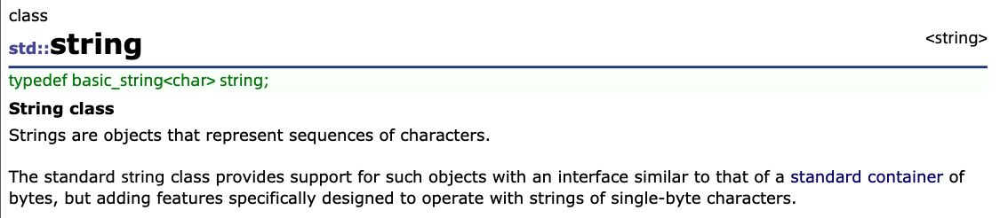
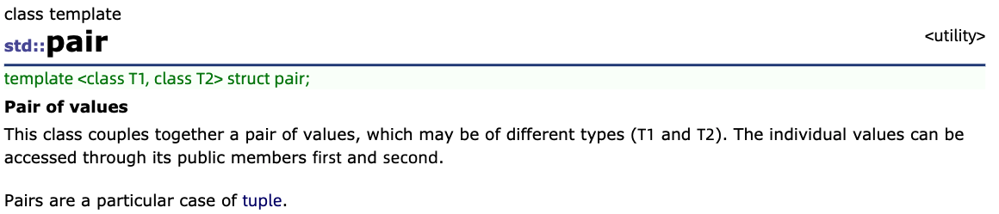

# data structure(STL)

### 概念

A **data structure** is a way to store data in the memory of a computer. It is important to choose an appropriate data structure for a problem, because each data structure has its own advantages and disadvantages. The crucial question is: which operations are efficient in the chosen data structure?

我们来介绍一下C++ standard library。STL(Standard Template Library)，C++ 有一个库，里面有很多好东西。是后来出现的，以前不流行，现在很流行的东西。我们学习了很多数据结构，就是那些用来存储数据的东西。在解决问题的时候，我们会选择合适的数据结构来存储这个问题的数据，是因为每个数据结构有优点和缺点。数据结构的相关操作，有一些函数是写好可以直接用的。（记住，你以后还会面临时间复杂度问题，不是所有情况都适合用 STL ，但是前期 STL 非常香）（C++11 现在在 noip 中还不能使用）


***It is a good idea to use the standard library whenever possible, because it will save a lot of time.***


### dynamic arrays(vector, string)

```cpp
vector<int> v;
v.push_back(3); // [3]
v.push_back(2); // [3,2]
v.push_back(5); // [3,2,5]

cout << v[0] << "\n"; // 3
cout << v[1] << "\n"; // 2
cout << v[2] << "\n"; // 5

for (int i = 0; i < v.size(); i++) {
    cout << v[i] << "\n";
}

vector<int> v;
v.push_back(5);
v.push_back(2);
cout << v.back() << "\n"; // 2
v.pop_back();
cout << v.back() << "\n"; // 5

// size 10, initial value 0
vector<int> v(10);

// size 10, initial value 5
vector<int> v(10, 5);

//vector的排序
sort(v.begin(), v.end());
reverse(v.begin(), v.end());

sort(a, a+n);
reverse(a, a+n);
```

<center>



</center>

The string structure is also a dynamic array that can be used almost like a vector. string类 类型也是一个动态数组，用起来很像vector，经常用的`s.substr(pos, length)` `int pos = s.find('c')`，还有`+`用来拼接两个string

```cpp
string a = "hatti";
string b = a+a;
cout << b << "\n"; // hattihatti
b[5] = ’v’;
cout << b << "\n"; // hattivatti
string c = b.substr(3,4);
cout << c << "\n"; // tiva

string c = b.substr(3);
cout << c << "\n"; // 这个是什么呢，请实践一下

int pos;
pos = b.find('a');
cout << pos << '\n';  //实践一下
	
pos = b.find('x');
cout << pos << '\n';  //实践一下
```


```cpp
//Note: 我们需要用到不同的头文件
#include <vector>
#include <set>
#include <queue>

//总之，可以用万能头
#include <bits/stdc++.h>
```


### set集合

A **set** is a data structure that maintains a collection of elements. The basic operations of sets are element insertion, search and removal.The benefit of the set structure is that it maintains the order of the elements.

vector如果要排序，需要sort一下；set就会默认是有序的

```cpp
set<int> s;
s.insert(3);
s.insert(2);
s.insert(5);
cout << s.count(3) << "\n"; // 1
cout << s.count(4) << "\n"; // 0
s.erase(3);
s.insert(4);
cout << s.count(3) << "\n"; // 0
cout << s.count(4) << "\n"; // 1
```


```cpp
set<int> s = {2,5,6,8};
cout << s.size() << "\n"; // 4
for (auto x : s) {        //C++11 用法
    cout << x << "\n";
}
```


```cpp
//set里面，每个元素只存一个
set<int> s;
s.insert(5);
s.insert(5);
s.insert(5);
cout << s.count(5) << "\n"; // 1
```


```cpp
//multiset里面，每个元素可以存多个
multiset<int> s;
s.insert(5);
s.insert(5);
s.insert(5);
cout << s.count(5) << "\n"; // 3
```


```cpp
//把5这个元素全删了
s.erase(5);
cout << s.count(5) << "\n"; // 0
//只删掉一个5元素
s.erase(s.find(5));
cout << s.count(5) << "\n"; // 2
```


### map

A **map** is a generalized array that consists of key-value-pairs. While the keys in an ordinary array are always the consecutive integers `0, 1 ,... , n−1`, where *n* is the size of the array, the keys in a map can be of any data type and they do not have to be consecutive values.

```cpp
map<string,int> m;
m["monkey"] = 4;
m["banana"] = 3;
m["harpsichord"] = 9;
cout << m["banana"] << "\n"; // 3
```

If the value of a key is requested but the map does not contain it, the key is automatically added to the map with a default value.**For example, in the following code, the key ”aybabtu” with value 0 is added to the map.**

```cpp
map<string,int> m;
cout << m["aybabtu"] << "\n"; // 0
```

所以，上述这个操作，不是很好，当查询次数很多，会造成空间问题（我在CF现场比赛中，真实遇见...，当时还不熟练这个操作）

```cpp
//判断是否存在，用count
if (m.count("aybabtu")) {
    // key exists
}

//C++11的遍历，我们自己写，要用interator
for (auto x : m) {
    cout << x.first << " " << x.second << "\n";
}
```

```cpp
//所以，我想问，能不能 map<int, string>
```


### pair

<center>



</center>

```cpp
pair<int, int> A, B;
A = make_pair(1, 2);    //比赛中可以用这种写法

//经常的，会这样去用
#include <bits/stdc++.h>
using namespace std;

typedef pair<int, int> PII;

const int N = 110;

PII a[N];

int main()
{
	int n;
    cin >> n;
    for (int i = 0; i < n; i++) cin >> a[i].first >> a[i].second;
    
    return 0;
}
```


### iterator迭代器

Many functions in **the C++ standard library** operate with iterators. An **iterator** is a variable that points to an element in a data structure. 用 iterator 来写遍历，遍历不同的容器，都可以用 iterator，但是只有部分容器支持下标访问，比如 vector。

```cpp
//set的遍历
set<int>::iterator it;
for (it = s.begin(); it != s.end(); it++) {
    cout << *it << "\n";
}

//输出最大元素
it = s.end(); it--;
cout << *it << "\n";

//查找元素是否存在
it = s.find(x);
if (it == s.end()) {
	//x is not found
}
```


```cpp
//示例
//set<pair<int, int> > 
#include <bits/stdc++.h>

using namespace std;

typedef pair<int, int> PII;

set<PII> s;

int main()
{
	s.insert(make_pair(3, 5));
	s.insert(make_pair(7, 9));
	s.insert(make_pair(11, 13));

	set<PII>::iterator it;
	for (it = s.begin(); it != s.end(); it++)
		printf("%d %d\n", (*it).first, (*it).second);

	return 0;
}
```


### bitset(这个不着急完全理解)

A **bitset** is an array whose each value is either 0 or 1. For example, the following code creates a bitset that contains 10 elements:

```cpp
bitset<10> s;
s[1] = 1;
s[3] = 1;
s[4] = 1;
s[7] = 1;
cout << s[4] << "\n"; // 1
cout << s[5] << "\n"; // 0
```

The benefit of using bitsets is that they require less memory than ordinary arrays, because each element in a bitset only uses one bit of memory. For example, if *n* bits are stored in an int array, ***32n*** bits of memory will be used, but a corresponding bitset only requires *n* bits of memory. In addition, the values of a bitset can be efficiently manipulated **using bit operators**, which makes it possible to optimize algorithms using bit sets.

```cpp
bitset<10> s(string("0010011010")); // from right to left
cout << s[4] << "\n"; // 1
cout << s[5] << "\n"; // 0

bitset<10> s(string("0010011010"));
cout << s.count() << "\n"; // 4

bitset<10> a(string("0010110110"));
bitset<10> b(string("1011011000"));
cout << (a&b) << "\n"; // 0010010000
cout << (a|b) << "\n"; // 1011111110
cout << (a^b) << "\n"; // 1001101110
```


### stack栈

A **stack** is a data structure that provides two ***O*(1)** time operations: adding an element to the top, and removing an element from the top. It is only possible to access the top element of a stack.

```cpp
stack<int> s;
s.push(3);
s.push(2);
s.push(5);
cout << s.top(); // 5
s.pop();
cout << s.top(); // 2
```


### queue队列

A **queue** also provides two ***O*(1)** time operations: adding an element to the end of the queue, and removing the first element in the queue. It is only possible to access the first and last element of a queue.

```cpp
queue<int> q;
q.push(3);
q.push(2);
q.push(5);
cout << q.front(); // 3
q.pop();
cout << q.front(); // 2
```


### priority_queue优先队列（用来实现堆操作）

A **priority queue** maintains a set of elements. The supported operations are insertion and, depending on the type of the queue, retrieval and removal of either the minimum or maximum element. Insertion and removal take ***O*(log *n*)** time, and retrieval takes ***O*(1)** time.

```cpp
priority_queue<int> q;
q.push(3);
q.push(5);
q.push(7);
q.push(2);
cout << q.top() << "\n"; // 7
q.pop();
cout << q.top() << "\n"; // 5
q.pop();
q.push(6);
cout << q.top() << "\n"; // 6
q.pop();
```

默认是大根堆，如果要写小根堆，就是push进去`x`的时候，push成`-x`，取出使用的时候，加个负号再使用。实现大根堆，还有一个方法，如下：

```cpp
priority_queue<int,vector<int>,greater<int> >q;//这样就可以实现小根堆了 
```

参考：[https://www.cnblogs.com/zwfymqz/p/7800654.html](https://www.cnblogs.com/zwfymqz/p/7800654.html), 如何实现自定义结构体的排序

