# graph图论

Many programming problems can be solved by modeling the problem as a graph problem and using an appropriate graph algorithm. A typical example of a graph is a network of roads and cities in a country. 


### 概念

A **graph** consists of **nodes** and **edges**. In this book, the variable *n* denotes the number of nodes in a graph, and the variable *m* denotes the number of edges. The nodes are numbered using integers 1,2,...,*n*. 下面这个图，有5个顶点，7条边。

<center>

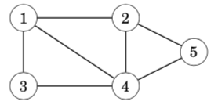

</center>

A **path** leads from node *a* to node *b* through edges of the graph. The **length** of a path is the number of edges in it. For example, the above graph contains a path 1→3→4→5 of length 3 from node 1 to node 5:

<center>

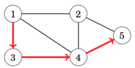

</center>

A path is a **cycle** if the first and last node is the same. For example, the above graph contains a cycle 1 → 3 → 4 → 1. A path is **simple** if each node appears at most once in the path.(概念，简单图)


### Connectivity连通性

A graph is **connected** if there is a path between any two nodes. For example, the following graph is connected:

<center>

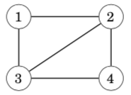

</center>

The following graph is not connected, because it is not possible to get from node 4 to any other node:

<center>

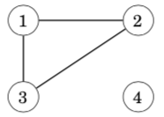

</center>

The connected parts of a graph are called its **components**. For example, the following graph contains three components: {1, 2, 3}, {4, 5, 6, 7} and {8}.

<center>

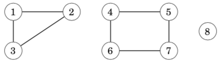

</center>

A **tree** is a connected graph that consists of *n* nodes and *n* − 1 edges. There is a unique path between any two nodes of a tree. For example, the following graph is a tree:

<center>

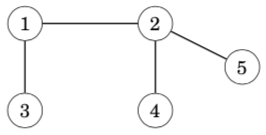

</center>

### Edge directions有向边

A graph is **directed** if the edges can be traversed in one direction only. For example, the following graph is directed:

<center>

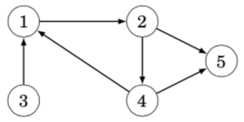

</center>

The above graph contains a path 3→1→2→5 from node 3 to node 5, but there is no path from node 5 to node 3.

无向边，其实，是两条有向边的合并版本

### Edge weights边权

In a **weighted** graph, each edge is assigned a **weight**. The weights are often interpreted as edge lengths. For example, the following graph is weighted:

<center>

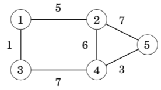

</center>

The length of a path in a weighted graph is the sum of the edge weights on the path. For example, in the above graph, the length of the path 1 → 2 → 5 is 12, and the length of the path 1→3→4→5 is 11. The latter path is the **shortest** path from node 1 to node 5.

### Neighbors and degrees相邻的两个顶点和顶点的度

Two nodes are **neighbors** or **adjacent** if there is an edge between them. The **degree** of a node is the number of its neighbors. For example, in the following graph, the neighbors of node 2 are 1, 4 and 5, so its degree is 3.

<center>

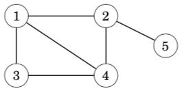

</center>

The sum of degrees in a graph is always 2*m*, where *m* is the number of edges, because each edge increases the degree of exactly two nodes by one. For this reason, the sum of degrees is always even.

A graph is **regular** if the degree of every node is a constant *d*. A graph is **complete** if the degree of every node is *n* − 1, i.e., the graph contains all possible edges between the nodes.

In a directed graph, the **indegree** of a node is the number of edges that end at the node, and the **outdegree** of a node is the number of edges that start at the node. For example, in the following graph, the indegree of node 2 is 2, and the outdegree of node 2 is 1.

<center>

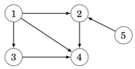

</center>

概念：完全图，每个顶点的度数都是n-1。在有向图中，分为入度和出度。

### Simplicity简单图

A graph is **simple** if no edge starts and ends at the same node, and there are no multiple edges between two nodes. Often we assume that graphs are simple. For example, the following graph is *not* simple:

<center>

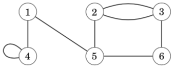

</center>

概念：简单图，无重边，无自环


### Adjacency list representation邻接表建图(vector版本)

In the adjacency list representation, each node *x* in the graph is assigned an **adjacency list** that consists of nodes to which there is an edge from *x*. Adjacency lists are the most popular way to represent graphs, and most algorithms can be efficiently implemented using them.

A convenient way to store the adjacency lists is to declare an array of vectors as follows:

```cpp
 vector<int> adj[N];
```

The constant *N* is chosen so that all adjacency lists can be stored. For example, the graph

<center>

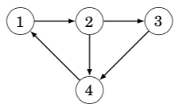

</center>

```cpp
adj[1].push_back(2);
adj[2].push_back(3);
adj[2].push_back(4);
adj[3].push_back(4);
adj[4].push_back(1);
```

If the graph is undirected, it can be stored in a similar way, but each edge is added in both directions.

For a weighted graph, the structure can be extended as follows:

```cpp
//当边权不是1的时候，可以用pair维护
vector<pair<int,int>> adj[N];
```

In this case, the adjacency list of node *a* contains the pair (*b*,*w*) always when there is an edge from node *a* to node *b* with weight *w*. For example, the graph can be stored as follows:

<center>

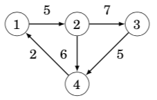

</center>

```cpp
adj[1].push_back({2,5});
adj[2].push_back({3,7});
adj[2].push_back({4,6});
adj[3].push_back({4,5});
adj[4].push_back({1,2});
```

The benefit of using adjacency lists is that we can efficiently find the nodes to which we can move from a given node through an edge. For example, the following loop goes through all nodes to which we can move from node *s*:

```cpp
//这是C++ 11的写法，在比赛中，还不能使用
for (auto u : adj[s]) {
    // process node u
}

//这样枚举就可以了，理解“散列边”这个概念
for (int i = 0; i < adj[i].size(); i++)
{

}
```

### Adjacency matrix representation邻接矩阵建图

An **adjacency matrix** is a two-dimensional array that indicates which edges the graph contains. We can efficiently check from an adjacency matrix if there is an edge between two nodes. The matrix can be stored as an array

```cpp
int adj[N][N];
```

where each value adj[*a*][*b*] indicates whether the graph contains an edge from node *a* to node *b*. If the edge is included in the graph, then adj[*a*][*b*] = 1, and otherwise adj[*a*][*b*] = 0. For example, the graph can be represented as follows:

<center>

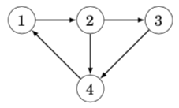


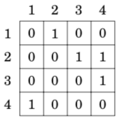

</center>

If the graph is weighted, the adjacency matrix representation can be extended so that the matrix contains the weight of the edge if the edge exists. Using this representation, the graph corresponds to the following matrix:

<center>

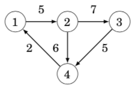

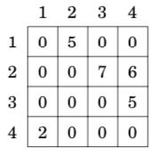

</center>

The drawback of the adjacency matrix representation is that the matrix contains **n^2** elements, and usually most of them are zero. For this reason, the representation cannot be used if the graph is large.

<center>

```cpp
你看，这个邻接矩阵是不是就是一个矩阵，表示一个点和另外一个点的连通性
```

```cpp
邻接矩阵不能存很大的图，因为受建立二维数组大小的限制。适合存稠密图
邻接表可以存很大的图，也可以存很小的图。更适合存稀疏图
```

</center>


### Adjacency list representation邻接表建图(一维数组版本)

我一般用这个方法

```cpp
int h[N], e[M], ne[M], idx; 

void add(int a, int b)
{
    e[idx] = b, ne[idx] = h[a], h[a] = idx++;
}

//调用
scanf("%d%d", &a, &b);
add(a, b), add(b, a);
//双向表，就双向add，单向边就一个add
//要注意一维数组开的大小问题，如果是无向图，M是N的两倍
//如果是有边权的情况，就还需要开一个一维数组w[M]用来维护边权
//理解“散列”的形状

//枚举边
for (int i = h[u]; i != -1; i = ne[i])
    {
        int j = e[i];
        if (!st[j])
        {
            int s = dfs(j);
            res = max(res, s); //所有子树的最大值
            sum += s;          //累积求这个点的子树大小
        }
    }
```


### Graph traversal图的遍历

depth-first search and breadth-first search. Both algorithms are given a starting node in the graph, and they visit all nodes that can be reached from the starting node. The difference in the algorithms is the order in which they visit the nodes.

### Depth-first search深度优先遍历

Depth-first search always follows a single path in the graph as long as it finds new nodes. After this, it returns to previous nodes and begins to explore other parts of the graph. The algorithm keeps track of visited nodes, so that it processes each node only once.

<center>

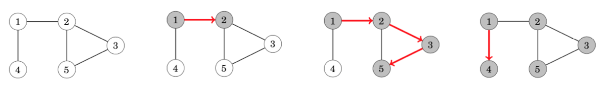

</center>

The neighbors of node 5 are 2 and 3, but the search has already visited both of them, so it is time to return to the previous nodes. Also the neighbors of nodes 3 and 2 have been visited, so we next move from node 1 to node 4

The time complexity of depth-first search is ***O*(*n* + *m*)** where *n* is the number of nodes and *m* is the number of edges, because the algorithm processes each node and edge once.

```cpp
vector<int> adj[N];
bool visited[N];

void dfs(int s) {
    if (visited[s]) return;
    visited[s] = true;
    // process node s
    for (auto u: adj[s]) {
		dfs(u);
    }
}
```

### Breadth-first search宽度优先遍历

**Breadth-first search** (BFS) visits the nodes in increasing order of their distance from the starting node. Thus, we can calculate the distance from the starting node to all other nodes using breadth-first search.

<center>

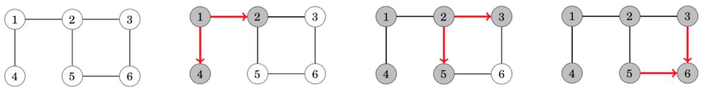

</center>

Like in depth-first search, the time complexity of breadth-first search is ***O*(*n* + *m*)**, where *n* is the number of nodes and *m* is the number of edges.

```cpp
queue<int> q;
bool visited[N];
int distance[N];

visited[x] = true;
distance[x] = 0;
q.push(x);
while (!q.empty()) {
    int s = q.front(); q.pop();
    // process node s
    for (auto u : adj[s]) {
       if (visited[u]) continue;
       visited[u] = true;
       distance[u] = distance[s]+1;
       q.push(u);
	} 
}
```

### Connectivity check连通性验证

从任意一个点出发，做dfs，可以判断这个图是否连通的。通过这种方法，我们也可以用来统计图当中，有多少个独立的块。从1...n遍历，如果一个点没遍历过，就dfs进去，遍历的时候进行标记。

<center>

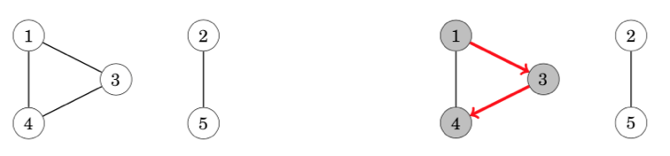

</center>

### Finding cycles判环

<center>

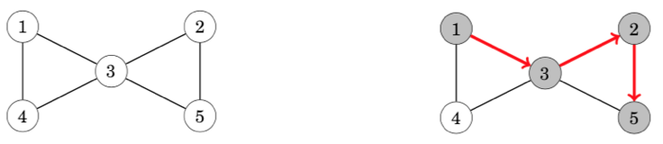

</center>

After moving from node 2 to node 5 we notice that the neighbor 3 of node 5 has already been visited. Thus, the graph contains a cycle that goes through node 3, for example, 3→2→5→3.

Another way to find out whether a graph contains a cycle is to simply calculate the number of nodes and edges in every component. If a component contains *c* nodes and no cycle, it must contain exactly *c* − 1 edges (so it has to be a tree). If there are *c* or more edges, the component surely contains a cycle.


### Shortest paths最短路

Finding a shortest path between two nodes of a graph is an important problem that has many practical applications. For example, a natural problem related to a road network is to calculate the shortest possible length of a route between two cities, given the lengths of the roads.

In an unweighted graph, the length of a path equals the number of its edges, and we can simply use breadth-first search to find a shortest path. However, in this chapter we focus on weighted graphs where more sophisticated algorithms are needed for finding shortest paths.

### Bellman–Ford algorithm单源最短路，负权边，可判负环，不超过k边

The **Bellman–Ford algorithm** finds shortest paths from a starting node to all nodes of the graph. The algorithm can process all kinds of graphs, provided that the graph does not contain a cycle with negative length. If the graph contains a negative cycle, the algorithm can detect this.

The algorithm keeps track of distances from the starting node to all nodes of the graph. Initially, the distance to the starting node is 0 and the distance to all other nodes in infinite. The algorithm reduces the distances by finding edges that shorten the paths until it is not possible to reduce any distance.

Let us consider how the Bellman–Ford algorithm works in the following graph:

<center>

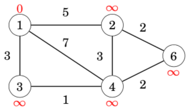

</center>

Each node of the graph is assigned a distance. Initially, the distance to the starting node is 0, and the distance to all other nodes is infinite.

The algorithm searches for edges that reduce distances. First, all edges from node 1 reduce distances:

<center>

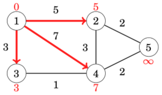

</center>

After this, edges 2 → 5 and 3 → 4 reduce distances:

<center>

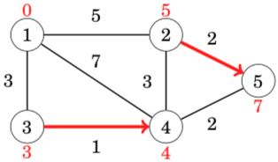

</center>

<center>


</center>

After this, no edge can reduce any distance. This means that the distances are final, and we have successfully calculated the shortest distances from the starting node to all nodes of the graph.

For example, the shortest distance 3 from node 1 to node 5 corresponds to the following path:

<center>

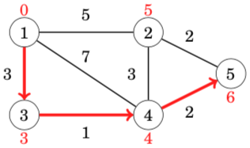

</center>

```cpp
//直接给出一个完整代码
#include <bits/stdc++.h>

using namespace std;

const int N = 2020, M = 220;

struct Edge
{
	int a, b, w;
}edge[N];

int n, m;
int d[M], bp[M];

int main()
{
	scanf("%d%d", &n, &m);
	for (int i = 1; i <= m; i++) 
		scanf("%d%d%d", &edge[i].a, &edge[i].b, &edge[i].w);

	memset(d, 0x3f, sizeof d);
	d[1] = 0;
	for (int i = 0; i < n - 1; i++)
	{
		memcpy(bp, d, sizeof bp);  //注意要backup，防止串联
		for (int j = 1; j <= m; j++)
		{
			int a = edge[j].a, b = edge[j].b, w = edge[j].w;
			if (d[b] > bp[a] + w) 
				d[b] = bp[a] + w;
		}
	}

	memcpy(bp, d, sizeof bp); //如果还能再更新，就存在环
	for (int j = 1; j <= m; j++)
	{
		int a = edge[j].a, b = edge[j].b, w = edge[j].w;
		if (d[b] > bp[a] + w) 
		{
			printf("circle\n");
			return 0;
		}
	}

	if (d[n] > 0x3f3f3f3f / 2) printf("can't arrive!\n");  //注意d[n]路径中有可能有负权边，不一定是INF，但会是INF量级的
	else printf("%d\n", d[n]);

	return 0;
}
```

```cpp
每个结点的最短距离，最多被更新n-1次
利用这个性质
我们循环n-1次，每次遍历所有的边，当d[b] > backup[a] + w的时候，就更新d[b]

再循环一次，如果还发生更新边的情况，就说明有负环

判断d[n] > 0x3f3f3f3f / 2，就说明不可达

1.为啥d[n] > 0x3f3f3f3f / 2，比如图中有两个点，第n-1个点，第n个点，n-1到n的距离是正值，但是如果n-1个点无法到达，第n个点也无法到达。但是d[n] 会被d[n-1]+w更新，0x3f3f3f3f-w
2.为啥用backup[a] + w来更新d[b],因为1-m每条边更新，如果一条边发生更新，会引发后面的边也传递更新，就发生了串联，就不对了
所以每次更新b的时候，我们用backup[a]的值
```

The time complexity of the algorithm is ***O*(*nm*)**, because the algorithm consists of *n* − 1 rounds and iterates through all *m* edges during a round. If there are no negative cycles in the graph, all distances are final after *n* − 1 rounds, because each shortest path can contain at most *n* − 1 edges.

In practice, the final distances can usually be found faster than in *n*−1 rounds. Thus, a possible way to make the algorithm more efficient is to stop the algorithm if no distance can be reduced during a round.


If the graph contains a negative cycle, we can shorten infinitely many times any path that contains the cycle by repeating the cycle again and again. Thus, the concept of a shortest path is not meaningful in this situation.

A negative cycle can be detected using the Bellman–Ford algorithm by running the algorithm for *n* rounds. If the last round reduces any distance, the graph contains a negative cycle. Note that this algorithm can be used to search for a negative cycle in the whole graph regardless of the starting node.


### SPFA algorithm队列优化的Bellman-Ford

The **SPFA algorithm** (”Shortest Path Faster Algorithm”)  is a variant of the Bellman–Ford algorithm, that is often more efficient than the original algorithm. The SPFA algorithm does not go through all the edges on each round, but instead, it chooses the edges to be examined in a more intelligent way.

The algorithm maintains a queue of nodes that might be used for reducing the distances. First, the algorithm adds the starting node *x* to the queue. Then, the algorithm always processes the first node in the queue, and when an edge *a* → *b* reduces a distance, node *b* is added to the queue.

The efficiency of the SPFA algorithm depends on the structure of the graph: the algorithm is often efficient, but its worst case time complexity is still ***O*(*nm*)** and it is possible to create inputs that make the algorithm as slow as the original Bellman–Ford algorithm.（如果是一个网格状的图，就会卡SPFA）

```cpp
//给出完整代码
#include <bits/stdc++.h>

using namespace std;

const int N = 1e5 + 10;

int n, m;
int h[N], w[N], e[N], ne[N], idx;
int d[N];
bool st[N]; //当前的点是不是在队列当中

void add(int a, int b, int c)
{
	e[idx] = b, ne[idx] = h[a], w[idx] = c, h[a] = idx++;
}

int spfa()
{
	memset(d, 0x3f, sizeof d);
	d[1] = 0;

	queue<int> q;
	q.push(1);
	st[1] = true;

	while (!q.empty())
	{
		int t = q.front(); q.pop();
		st[t] = false;  //维护在没在队列里

        //t变小，他的所有所有出边可能变小。更新过谁，再拿它去更新别人
		for (int i = h[t]; i != -1; i = ne[i])  
		{
			int j = e[i];
			if (d[j] > d[t] + w[i])
			{
				d[j] = d[t] + w[i];
				if (!st[j])
				{
					q.push(j);
					st[j] = true;
				}
			}
		}
	}
	
	return d[n];
}

int main()
{
	scanf("%d%d", &n, &m);

	memset(h, -1, sizeof h);
	for (int i = 0; i < m; i++)
	{
		int a, b, c;
		scanf("%d%d%d", &a, &b, &c);

		add(a, b, c);
	}

	int res = spfa();

	if (res == 0x3f3f3f3f) printf("impossible\n"); //spfa只会更新所有能从起点走到的点，所以如果无解，那么起点就走不到终点，那么终点的距离就是0x3f3f3f3f
	else printf("%d\n", res);

	return 0;
}
```


### Dijkstra’s algorithm单源最短路，边权都是正数

**Dijkstra’s algorithm** finds shortest paths from the starting node to all nodes of the graph, like the Bellman–Ford algorithm. The benefit of Dijsktra’s algorithm is that it is more efficient and can be used for processing large graphs. However, the algorithm requires that there are no negative weight edges in the graph.（原理是基于贪心）

Like the Bellman–Ford algorithm, Dijkstra’s algorithm maintains distances to the nodes and reduces them during the search. Dijkstra’s algorithm is efficient, because it only processes each edge in the graph once, using the fact that there are no negative edges.

Let us consider how Dijkstra’s algorithm works in the following graph when the starting node is node 1:

<center>

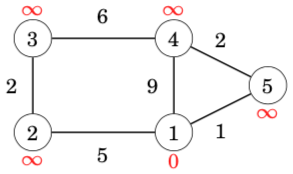

</center>

Like in the Bellman–Ford algorithm, initially the distance to the starting node is 0 and the distance to all other nodes is infinite.

At each step, Dijkstra’s algorithm selects a node that has not been processed yet and whose distance is as small as possible. The first such node is node 1 with distance 0.

When a node is selected, the algorithm goes through all edges that start at the node and reduces the distances using them:

<center>

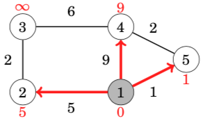

</center>

In this case, the edges from node 1 reduced the distances of nodes 2, 4 and 5, whose distances are now 5, 9 and 1. The next node to be processed is node 5 with distance 1. This reduces the distance to node 4 from 9 to 3:

<center>

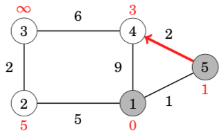

</center>

After this, the next node is node 4, which reduces the distance to node 3 to 9:

<center>

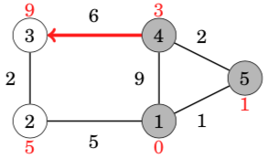

</center>

A remarkable property in Dijkstra’s algorithm is that whenever a node is selected, its distance is final. For example, at this point of the algorithm, the distances 0, 1 and 3 are the final distances to nodes 1, 5 and 4.

After this, the algorithm processes the two remaining nodes, and the final distances are as follows:

<center>

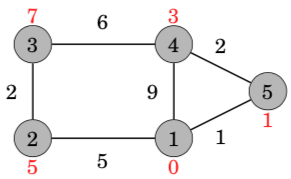

</center>


对于有负权边的图，Dijkstra是不可用的。The shortest path from node 1 to node 4 is 1 → 3 → 4 and its length is 1. However, Dijkstra’s algorithm finds the path 1 → 2 → 4 by following the minimum weight edges. The algorithm does not take into account that on the other path, the weight −5 compensates the previous large weight 6.

<center>

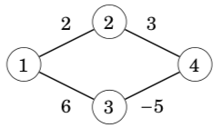

</center>

```cpp
//朴素版，稠密图，O(n^2)
#include <cstring>
#include <iostream>
#include <algorithm>

using namespace std;

const int N = 510;

int n, m;
int g[N][N];
int dist[N];
bool st[N];

int dijkstra()
{
    memset(dist, 0x3f, sizeof dist);
    dist[1] = 0;

    for (int i = 0; i < n - 1; i++)
    {
        int t = -1;
        for (int j = 1; j <= n; j++)
            if (!st[j] && (t == -1 || dist[t] > dist[j]))
                t = j;

        st[t] = true;

        for (int j = 1; j <= n; j++)
            dist[j] = min(dist[j], dist[t] + g[t][j]);
    }

    if (dist[n] == 0x3f3f3f3f) return -1;  
    else dist[n];
}

int main()
{
    scanf("%d%d", &n, &m);

    memset(g, 0x3f, sizeof g);

    while (m--)
    {
        int a, b, c;
        scanf("%d%d%d", &a, &b, &c);
        g[a][b] = min(g[a][b], c);  //重边，邻接矩阵中只存最小的权值
    }

    int t = dijkstra();

    printf("%d\n", t);

    return 0;
}
```

```cpp
//堆优化版，稀疏图，O(n + mlogm)
//the algorithm goes through all nodes of the graph and adds for each edge at most one distance to the priority queue.

#include <bits/stdc++.h>

using namespace std;

typedef pair<int, int> PII;

const int N = 1e4 + 10, M = 2e5 + 10, INF = 0x3f3f3f3f;

int n, m, st, ed;
int h[N], e[M], ne[M], w[M], idx;
int d[N];
bool vis[N];

void add(int a, int b, int c)
{
	e[idx]=  b, w[idx] = c, ne[idx] = h[a], h[a] = idx++;
}

int dijkstra()
{
	memset(d, 0x3f, sizeof d);
	d[st] = 0;

	priority_queue<int> q;
	q.push(make_pair(0, st));

	while (!q.empty())
	{
		PII t = q.top(); q.pop();
		int ver = t.second, dist = -t.first;

		if (vis[ver]) continue;
		vis[ver] = true;
		
		//加强一下对i的理解，for枚举的是散列边，w[i]是边的长度，就是点到点的距离。d[j]>dist+w[i] 
		for (int i = h[ver]; i != -1; i = ne[i])
		{
			int j = e[i];
			if (d[j] > dist + w[i])
			{
				d[j] = dist + w[i];
				q.push(make_pair(-d[j], j));
			}
		}
	}

	if (d[ed] == INF) return -1;
	else return d[ed];
}

int main()
{
	scanf("%d%d%d%d", &n, &m, &st, &ed);

	memset(h, -1, sizeof h);
	while (m--)
	{
		int a, b, c;
		scanf("%d%d%d", &a, &b, &c);

		add(a, b, c);
	}

	int res = dijkstra();
	printf("%d\n", res);

	return 0;
}
```


### Floyd–Warshall algorithm多源汇最短路

The **Floyd–Warshall algorithm** provides an alternative way to approach the problem of finding shortest paths. Unlike the other algorithms of this chapter, it finds all shortest paths between the nodes in a single run.

The algorithm maintains a two-dimensional array that contains distances between the nodes. First, distances are calculated only using direct edges between the nodes, and after this, the algorithm reduces distances by using intermediate nodes in paths.

<center>

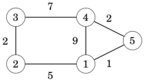

</center>

Initially, the distance from each node to itself is 0, and the distance between nodes *a* and *b* is *x* if there is an edge between nodes *a* and *b* with weight *x*. All other distances are infinite.

In this graph, the initial array is as follows:

<center>

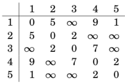

</center>

The algorithm consists of consecutive rounds. On each round, the algorithm selects a new node that can act as an intermediate node in paths from now on, and distances are reduced using this node.

On the first round, node 1 is the new intermediate node. There is a new path between nodes 2 and 4 with length 14, because node 1 connects them. There is also a new path between nodes 2 and 5 with length 6.

<center>

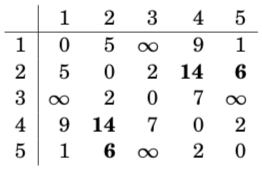

</center>

On the second round, node 2 is the new intermediate node. This creates new paths between nodes 1 and 3 and between nodes 3 and 5:

<center>

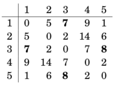

</center>

On the third round, node 3 is the new intermediate round. There is a new path between nodes 2 and 4:

<center>

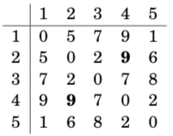

</center>

The algorithm continues like this, until all nodes have been appointed inter- mediate nodes. After the algorithm has finished, the array contains the minimum distances between any two nodes:

<center>

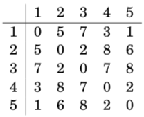

</center>

For example, the array tells us that the shortest distance between nodes 2 and 4 is 8. This corresponds to the following path:

<center>

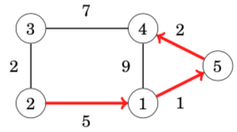

</center>

```cpp
//完整代码
#include <cstring>
#include <iostream>
#include <algorithm>

using namespace std;

const int N = 210, INF = 1e9;

int n, m, Q;
int d[N][N];

void floyd()
{
    for (int k = 1; k <= n; k++)
        for (int i = 1; i <= n; i++)
            for (int j = 1; j <= n; j++)
                d[i][j] = min(d[i][j], d[i][k] + d[k][j]);
}

int main()
{
    scanf("%d%d%d", &n, &m, &Q);

    for (int i = 1; i <= n; i++)
        for (int j = 1; j <= n; j++)
            if (i == j) d[i][j] = 0;
            else d[i][j] = INF;

    while (m--)
    {
        int a, b, w;
        scanf("%d%d%d", &a, &b, &w);

        d[a][b] = min(d[a][b], w);
    }

    floyd();

    while (Q--)
    {
        int a, b;
        scanf("%d%d", &a, &b);

        if (d[a][b] > INF / 2) puts("impossible");
        else printf("%d\n", d[a][b]);
    }

    return 0;
}
```


The time complexity of the algorithm is ***O*(*n^*3)**, because it contains three nested loops that go through the nodes of the graph.

Since the implementation of the Floyd–Warshall algorithm is simple, the algorithm can be a good choice even if it is only needed to find a single shortest path in the graph. However, the algorithm can only be used when the graph is so small that a cubic time complexity is fast enough.（Floyd的原理是动态规划，因为需要使用三重循环，和邻接矩阵建图，要注意数据范围，还有图不能很大）


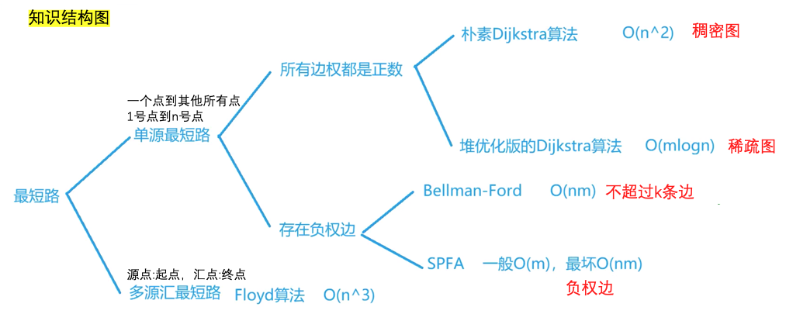

from yxc，orz..


### 《一本通》题目

##### [【例题】一笔画问题](http://ybt.ssoier.cn:8088/problem_show.php?pid=1341)

```cpp
//寻找欧拉路/欧拉回路。
//找到入度是奇数的点，这个点作为出发点。否则就从1开始出发
//dfs()遍历图，一边走一遍划掉边
```

##### [铲雪车(snow)](http://ybt.ssoier.cn:8088/problem_show.php?pid=1374)

```cpp
//每条道路都是双向道路，题面说明可以遍历所有街道，那一定是欧拉回路的
//直接利用欧拉回路的性质解题
//需要注意的是时间有可能很大，不开LL见祖宗
```

##### [骑马修栅栏(fence)](http://ybt.ssoier.cn:8088/problem_show.php?pid=1375)

```cpp
//一笔画问题，一笔遍历完所有栅栏
//完成建图后，从度数是奇数的点出发，进行dfs()，一边走一边抹掉边
//题目中没有给出结点编号范围，在读入的时候，明确一下起始和终止结点编号
```

##### [【例4-1】最短路径问题](http://ybt.ssoier.cn:8088/problem_show.php?pid=1342)

```cpp
//n<=100
//朴素dijkstra
```

##### [ 【例4-2】牛的旅行](http://ybt.ssoier.cn:8088/problem_show.php?pid=1343)

```cpp
//n<=150
//编程找出一条连接两个不同牧场的路径，使得连上这条路径后，这个更大的新牧场有最小的直径

//floyd预处理两点之间的最短距离
//用来判断两个点是否在一个连通块内
//先更新一遍连通块内部的最大直径，维护一个s1[N]
//res1，代表连通块的最大直径
//再暴力枚举，连接两个不连通的两个点，更新一个连上之后半径
//res2，代表连上两个连通块之后的半径
//问：使得连上这条路径后，这个更大的新牧场有最小的直径
//输出min(res1, res2)
```

##### [【例4-4】最小花费](http://ybt.ssoier.cn:8088/problem_show.php?pid=1344)

```cpp
//n<=2000
//转账需要扣除手续费，问终点的人收到100元，起点的人，最少需要准备多少钱
//最短路问题
//如果边长是1.0 * (100 - c) / 100, c代表扣除的手续费
//那么就是用朴素dijkstra跑一遍最长路
```

###### [【例4-6】香甜的黄油](http://ybt.ssoier.cn:8088/problem_show.php?pid=1345)

```cpp
//找出使所有牛到达的路程和最短的牧场（他将把糖放在那）
//奶牛n<=500,牧场p<=800
//枚举所有的牧场，跑最短路，更新res
//可以用spfa，堆优化dijkstra
```

##### [信使(msner)](http://ybt.ssoier.cn:8088/problem_show.php?pid=1376)

```cpp
//n<=100
//所有结点到结点1距离的最小值
//跑一遍floyd，找一遍答案，如果发现有无法到达的结点就输出-1
```

##### [最优乘车(travel)](http://ybt.ssoier.cn:8088/problem_show.php?pid=1377)

```cpp
//n<=500
//这道题思路比较巧妙，第一反应是分层图，很快就验证不对
//正确思路：一条公交路线上的结点(注意是单向)，这些结点的距离都是1
//那么从起点，到终点的最短路，减去1，就是答案
//最短路可用floyd

//恶心的是输入，不好处理
//方法一：还要注意把第一行的回车处理好
	getline(cin, s);
	stringstream ssin(s);
	while (ssin >> x) a[idx++] = x;
//方法二：
	scanf("%d", &a[idx++]);
	ch = getchar();
	while (ch==' '){
		scanf("%d", &x);
		a[idx++] = x;
		ch = getchar();
	}
```

##### [最短路径(shopth)](http://ybt.ssoier.cn:8088/problem_show.php?pid=1378)

``` cpp
//n<=80，题意也是明显的floyd最短路
//恶心的还是读入
	for (int i = 1; i <= n; i++)
		for (int j = 1; j <= n; j++){
			if (scanf("%d", &x) == 1) dp[i][j] = x;
		}
//这种方法在本地无法通过验证
//提交oj可以AC
//尝试getline() 然后处理'-' '负数' '正数'的方法，只能过40分，作罢
```

##### [热浪(heatwv)](http://ybt.ssoier.cn:8088/problem_show.php?pid=1379)

```cpp
//T<=2500
//跑spfa
```

##### [分糖果(candy)](http://ybt.ssoier.cn:8088/problem_show.php?pid=1380)

```cpp
//求第多少秒所有小朋友都吃完了糖
//spfa求得距离C小朋友最远的距离far
//答案是far + 1 + m
//传到最远位置的时间，第一个人消耗的时间，最后一个人吃的时间
```

##### [ 城市路(Dijkstra)](http://ybt.ssoier.cn:8088/problem_show.php?pid=1381)

```cpp
//n<=2000
//朴素dijkstra
//bellman_ford也可以
```

##### [最短路(Spfa)](http://ybt.ssoier.cn:8088/problem_show.php?pid=1382)

```cpp
//n<=1e5
//有重边、自环，跑spfa求最短路
//读入的时候，可以不理会重边和自环问题
```

##### [ SPFA(II)](http://ybt.ssoier.cn:8088/problem_show.php?pid=1419)

```cpp
//n<=20000
//spfa
```

##### [Dijkastra(II)](http://ybt.ssoier.cn:8088/problem_show.php?pid=1420)

```cpp
//n<=2e5
//堆优化dijkstra
```

##### [ Floyd](http://ybt.ssoier.cn:8088/problem_show.php?pid=1421)

```cpp
//n<=500, floyd
//题目不存在负环，但是可能存在负边
//这样会造成dist < INF 但是也是不可达
//最后计算结果前，对不可达的点，刷一遍，刷成INF
```

##### [刻录光盘(cdrom)](http://ybt.ssoier.cn:8088/problem_show.php?pid=1383)

```cpp
//图的连通性问题
//利用floyd，判断出两个点是否可达
//two loops枚举所有两个点组合，用并查集p[i]来更新父亲
//最后one loops遍历一遍有几个结点的p[i]==i,就说明需要几个光盘
```

##### [珍珠(bead)](http://ybt.ssoier.cn:8088/problem_show.php?pid=1384)

```cpp
//读入的时候，dp[a][b]=1，表示a比b大
//跑floyd，得到所有两两关系
//two loops枚举两点，统计对于每个点，有多少个点比自己大，有多少个点比自己小
if ((cnt[i] >= (n+1)/2) || (cnt2[i] >= (n+1)/2)) res++;
```

##### [【例4-7】亲戚(relation)](http://ybt.ssoier.cn:8088/problem_show.php?pid=1346)

```cpp
//并查集
//只能通过90分，网上的题解也不能AC
//网站上还是有2500多人AC的【待办】
```

##### [【例4-8】格子游戏](http://ybt.ssoier.cn:8088/problem_show.php?pid=1347)

```cpp
//并查集
//二维转一维的操作(x = (a - 1) * n + b;)
//两个点是否在一个集合里，如何在，那么连上就成圈了
//整个看成一个图，容易理解
```

##### [团伙(group)](http://ybt.ssoier.cn:8088/problem_show.php?pid=1385)

```cpp
//并查集
//1、我朋友的朋友是我的朋友；2、我敌人的敌人是我的朋友；
//使用vector<int> h[N]存储每个点的所有敌人，类似开放链
//当读到两个人是敌人，就枚举一遍已有的敌人，敌人的敌人是朋友，建立起朋友关系
//最后看p[N]中有几个祖宗，可以用set<int>进行统计
```

##### [打击犯罪(black)](http://ybt.ssoier.cn:8088/problem_show.php?pid=1386)

```cpp
//并查集
//p[N]维护祖先，son[N]维护子树大小
//所有有关系的团队，都是编号大的向编号小的合并，合并的时候，更新子树大小
//最后把son[k]>n/2的干掉，1...k都干掉（从n往1遍历找到一个满足条件的i就是答案）
```

##### [搭配购买(buy)](http://ybt.ssoier.cn:8088/problem_show.php?pid=1387)

```cpp
//并查集+01背包（题意不是只可以买一个集合的，可以买多个集合的，要考虑到这些）
//并查集维护出来每一个集合的体积和，价值和
//然后对这些体积和，价值和，进行01背包，求max
```

##### [家谱(gen)](http://ybt.ssoier.cn:8088/problem_show.php?pid=1388)

```cpp
//并查集
//用map<string, string> p;维护祖先关系
```

##### [亲戚](http://ybt.ssoier.cn:8088/problem_show.php?pid=1389)

```cpp
//并查集
//p[N]维护祖先, son[N]维护子树大小
```

##### [食物链【NOI2001】](http://ybt.ssoier.cn:8088/problem_show.php?pid=1390)

```cpp
//三类动物的食物链构成了有趣的环形。A吃B， B吃C，C吃A
//此题精华：知道每个点和根结点的关系,就能知道每个点之间的关系
//到根结点距离是1，可以吃根
//到根结点距离是2，可以被根吃
//到根结点距离是3，与根同类

//在一个组织里，求两人之间的距离，只需要知道和领袖之间的距离
//d[x],d[y]的差值，看mod 3的值，来分析吃与被吃的关系

//部分示例代码
if (op == 1){
	if (px == py && ((d[x] - d[y])%3 != 0)) res++;
	else if (px != py){		
        p[px] = py;
		d[px] = d[y] - d[x];
	}
}

int find(int x)
{
	if (p[x] != x){
		int t = find(p[x]);
		d[x] += d[p[x]];  //递归的加上每一个前辈的距离，就是到祖先的距离
		p[x] = t;
	}
	return p[x];
}
```

##### [ 【例4-9】城市公交网建设问题](http://ybt.ssoier.cn:8088/problem_show.php?pid=1348)

```cpp
//n<=100, MST
//kruscal，取边的时候，维护到答案里
```

##### [【例4-10】最优布线问题](http://ybt.ssoier.cn:8088/problem_show.php?pid=1349)

```cpp
//n<=100, MST
//prim
```

##### [【例4-11】最短网络(agrinet)](http://ybt.ssoier.cn:8088/problem_show.php?pid=1350)

```cpp
//n<=100, MST
//prim
```

##### [【例4-12】家谱树](http://ybt.ssoier.cn:8088/problem_show.php?pid=1351)

```cpp
//topsort
```

##### [局域网(net)](http://ybt.ssoier.cn:8088/problem_show.php?pid=1391)

```cpp
//n<=100, MST
//prim
```

##### [繁忙的都市(city)](http://ybt.ssoier.cn:8088/problem_show.php?pid=1392)

```cpp
//边长进行排序(greedy)，做并查集
//维护选出了几条道路，分值最大的那条道路的分值
```

##### [联络员(liaison)](http://ybt.ssoier.cn:8088/problem_show.php?pid=1393)

```cpp
//通讯渠道分为两类，一类必选，一类选择性选择
//必选都选上，维护res，维护并查集关系
//然后选择性边排序(greedy)，做并查集
```

##### [ 连接格点(grid)](http://ybt.ssoier.cn:8088/problem_show.php?pid=1394)

```cpp
//二维转一维的操作
//优先对纵向(花费1)做并查集，然后对横向(花费2)做并查集
```

##### [【例4-13】奖金](http://ybt.ssoier.cn:8088/problem_show.php?pid=1352)

```cpp
//满足各位代表的意见，且同时使得总奖金数最少
//反向建边，add(b, a); in[a]++, 进行topsort
//反向处理的时候，后一结点比前一结点花费多1(员工a的奖金应该比b高)
```

##### [烦人的幻灯片(slides)](http://ybt.ssoier.cn:8088/problem_show.php?pid=1395)

```cpp
//幻灯片用字母表示
//每个数字的位置读入后，判断都在哪些字母范围内
//建边g[j][i] = 1; //字母j到数字i有边，同时，维护好in[i]，数字的度数
//这样就形成了一个两个集合的映射关系，从数字度数为1的，进行topsort
//topsort(u)，查找和数字u有关系的字母i，紧接着看那些数字j和字母i有关系
//把边抹掉，in[j]--。如果in[j]==1，topsort(j)
```

##### [ 病毒(virus)](http://ybt.ssoier.cn:8088/problem_show.php?pid=1396)

```cpp
//病毒污染了字典，把字母换成了另外一个字母，但是相对顺序没有改变
//给了多个字符串，读入后，维护起来污染后字母的相对顺序，然后做topsort
//做topsort的时候，维护好d[i]，存的是原字母相对于a的偏移
//遍历一遍d[i]，维护map<char, char>
//对要翻译的字符串进行处理，如果遇到没有翻译的字符，就是字典不全
```

