# graph图论(三)

### Spanning trees生成树(连通+无环)

A **spanning tree** of a graph consists of all nodes of the graph and some of the edges of the graph so that there is a path between any two nodes. Like trees in general, spanning trees are **connected(连通的) and acyclic(无环)**. Usually there are several ways to construct a spanning tree.

A **minimum spanning tree** is a spanning tree whose weight is as small as possible. 

In a similar way, a **maximum spanning tree** is a spanning tree whose weight is as large as possible. 

<center>

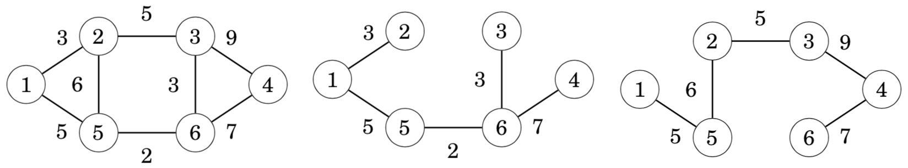

</center>


### Kruskal’s algorithm

In **Kruskal’s algorithm**, the initial spanning tree only contains the nodes of the graph and does not contain any edges. Then the algorithm goes through the edges ordered by their weights, and always adds an edge to the tree if it does not create a cycle.

The algorithm maintains the components of the tree. Initially, each node of the graph belongs to a separate component. Always when an edge is added to the tree, two components are joined. Finally, all nodes belong to the same component, and a minimum spanning tree has been found.

<center>


</center>

The first step of the algorithm is to sort the edges in increasing order of their weights. The result is the following list:

<center>

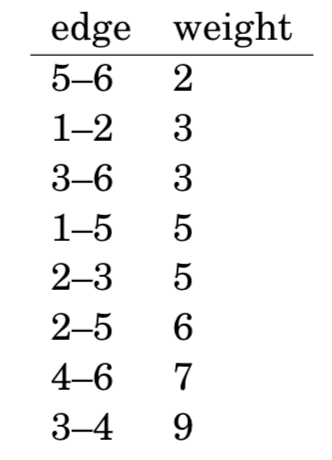

</center>

After this, the algorithm goes through the list and adds each edge to the tree if it joins two separate components.Initially, each node is in its own component:

<center>

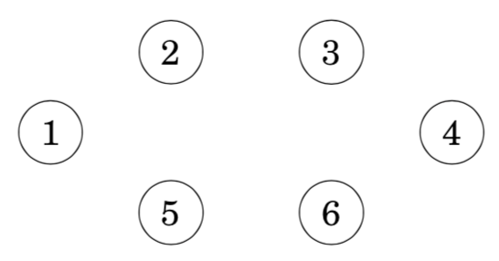

</center>

The first edge to be added to the tree is the edge 5–6 that creates a component {5,6} by joining the components {5} and {6}. 

<center>

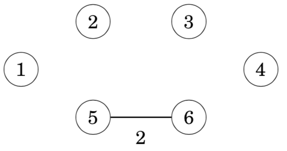

</center>

After this, the edges 1–2, 3–6 and 1–5 are added in a similar way.

<center>

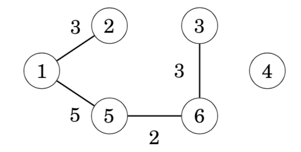

</center>

After those steps, most components have been joined and there are two components in the tree: {1,2,3,5,6} and {4}.

The next edge in the list is the edge 2–3, but it will not be included in the tree, because nodes 2 and 3 are already in the same component. For the same reason, the edge 2–5 will not be included in the tree.

Finally, the edge 4–6 will be included in the tree:

<center>

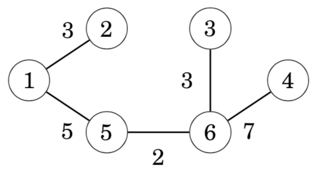

</center>

After this, the algorithm will not add any new edges, because the graph is connected and there is a path between any two nodes. The resulting graph is a minimum spanning tree with weight 2+3+3+5+7=20.

**Why does this work?**

It is a good question why Kruskal’s algorithm works. Why does the greedy strategy guarantee that we will find a minimum spanning tree?

Let us see what happens if the minimum weight edge of the graph is *not* included in the spanning tree. For example, suppose that a spanning tree for the previous graph would not contain the minimum weight edge 5–6. We do not know the exact structure of such a spanning tree, but in any case it has to contain some edges. Assume that the tree would be as follows:

<center>

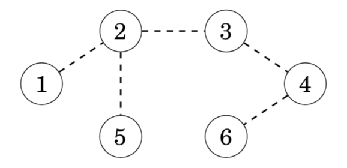

</center>

However, it is not possible that the above tree would be a minimum spanning tree for the graph. The reason for this is that we can remove an edge from the tree and replace it with the minimum weight edge 5–6. This produces a spanning tree whose weight is *smaller*:

<center>

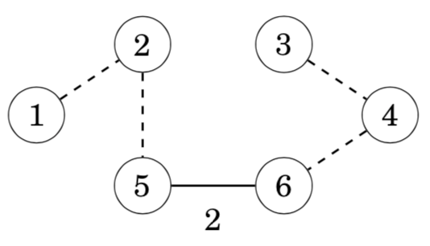

</center>

For this reason, it is always optimal to include the minimum weight edge in the tree to produce a minimum spanning tree. Using a similar argument, we can show that it is also optimal to add the next edge in weight order to the tree, and so on. Hence, Kruskal’s algorithm works correctly and always produces a minimum spanning tree.

**Implementation**

When implementing Kruskal’s algorithm, it is convenient to use the edge list representation of the graph. The first phase of the algorithm sorts the edges in the list in ***O*(*m*log*m*)** time. After this, the second phase of the algorithm builds the minimum spanning tree as follows:

```cpp
for (...) {
  if (!same(a,b)) unite(a,b);
}
```

We will solve the problem using a union-find structure that implements both functions in ***O*(log *n*) **time. Thus, the time complexity of Kruskal’s algorithm will be ***O*(*m* log *n*) **after sorting the edge list.

> 此处，O(mlogm), O(mlogn)都是对的

```cpp
//示例代码
#include <iostream>
#include <algorithm>

using namespace std;

const int N = 200010;//SE问题，也可能出现在这里，一般就是边界问题

int n, m;
int p[N];

struct Edge
{
    int a, b, w;

    bool operator< (const Edge &W)const
    {
        return w < W.w;
    }
}edges[N];

int find(int x)
{
    if (p[x] != x) p[x] = find(p[x]);
    return p[x];
}

int main()
{   
    scanf("%d%d", &n, &m);

    for (int i = 0; i < m; i++)
    {
        int a, b, w;
        scanf("%d%d%d", &a, &b, &w);
        edges[i] = {a, b, w};
    }

    //直接写kruscal, 不用把他单独包起来了
    sort(edges, edges + m);

    for (int i = 1; i <= n; i++) p[i] = i;

    int res = 0, cnt = 0;
    for (int i = 0; i < m; i++)
    {
        int a = edges[i].a, b = edges[i].b, w = edges[i].w;

        a = find(a), b = find(b);
        if (a != b)
        {
            p[a] = b;
            res += w;//最小生成树，所有树边的权重之和
            cnt++; //当前加了多少条边
        }
    }

    if (cnt < n - 1) puts("impossible");
    else printf("%d\n", res);

    return 0;
}
```

### Union-find structure并查集

A **union-find structure** maintains a collection of sets. The sets are disjoint, so no element belongs to more than one set. Two ***O*(log*n*)** time operations are supported: the unite operation joins two sets, and the find operation finds the representative of the set that contains a given element.

**structure数据结构**

In a union-find structure, one element in each set is the representative of the set, and there is a chain from any other element of the set to the representative. For example, assume that the sets are {1,4,7}, {5} and {2,3,6,8}:

<center>

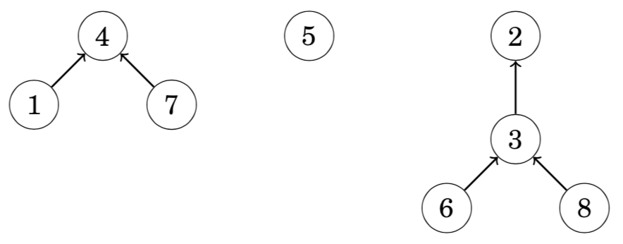

</center>

In this case the representatives of the sets are 4, 5 and 2. We can find the representative of any element by following the chain that begins at the element. For example, the element 2 is the representative for the element 6, because we follow the chain 6 → 3 → 2. Two elements belong to the same set exactly when their representatives are the same.

Two sets can be joined by connecting the representative of one set to the representative of the other set. For example, the sets {1,4,7} and {2,3,6,8} can be joined as follows:

<center>

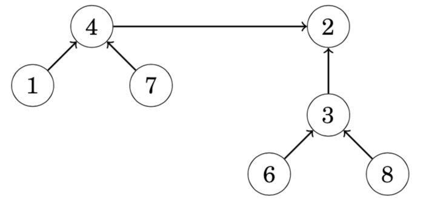

</center>

The resulting set contains the elements {1,2,3,4,6,7,8}. From this on, the element 2 is the representative for the entire set and the old representative 4 points to the element 2.

The efficiency of the union-find structure depends on how the sets are joined. It turns out that we can follow a simple strategy: always connect the representa- tive of the *smaller* set to the representative of the *larger* set (or if the sets are of equal size, we can make an arbitrary choice). Using this strategy, the length of any chain will be ***O*(log*n*)**, so we can find the representative of any element efficiently by following the corresponding chain.

```cpp
//初始化
for (int i = 1; i <= n; i++) p[i] = i;

//合并
p[find(a)] = find(b);  
//或者
int pa = find(a), pb = find(b);
if (pa != pb) p[pa] = pb;

int find(int x)  //返回x的祖宗结点+路径压缩
{
    if (p[x] != x) p[x] = find(p[x]);
    return p[x];
}
```


```cpp
//另外一份模板
//the array link contains for each element the next element in the chain or the element itself if it is a representative, and the array size indicates for each representative the size of the corresponding set.
for (int i = 1; i <= n; i++) link[i] = i;
for (int i = 1; i <= n; i++) size[i] = 1;

void unite(int a, int b) {
    a = find(a);
    b = find(b);
    if (size[a] < size[b]) swap(a,b);
    size[a] += size[b];
    link[b] = a;
}
```


### Prim’s algorithm

**rim’s algorithm** is an alternative method for finding a minimum spanning tree. The algorithm first adds an arbitrary node to the tree. After this, the algorithm always chooses a minimum-weight edge that adds a new node to the tree. Finally, all nodes have been added to the tree and a minimum spanning tree has been found.

Prim’s algorithm resembles Dijkstra’s algorithm. The difference is that Dijkstra’s algorithm always selects an edge whose distance from the starting node is minimum, but Prim’s algorithm simply selects the minimum weight edge that adds a new node to the tree.

Let us consider how Prim’s algorithm works in the following graph:

<center>

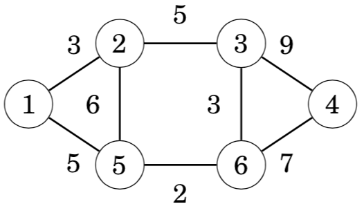

</center>

Initially, there are no edges between the nodes:

<center>

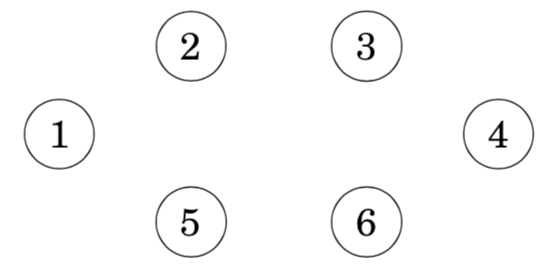

</center>

An arbitrary node can be the starting node, so let us choose node 1. First, we add node 2 that is connected by an edge of weight 3:

<center>

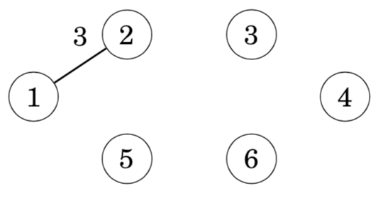

</center>

After this, there are two edges with weight 5, so we can add either node 3 or node 5 to the tree. Let us add node 3 first:

<center>

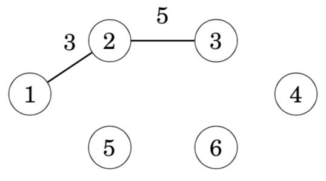

</center>

The process continues until all nodes have been included in the tree:

<center>

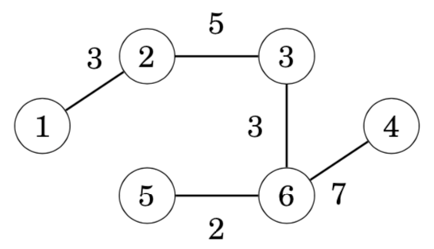

</center>

**Implementation**

Like Dijkstra’s algorithm, Prim’s algorithm can be efficiently implemented using a priority queue. The priority queue should contain all nodes that can be connected to the current component using a single edge, in increasing order of the weights of the corresponding edges.

The time complexity of Prim’s algorithm is ***O*(*n*+*m*log*m*)** that equals the time complexity of Dijkstra’s algorithm. In practice, Prim’s and Kruskal’s algorithms are both efficient, and the choice of the algorithm is a matter of taste. Still, most competitive programmers use Kruskal’s algorithm.

```cpp
//示例代码
#include <cstring>
#include <iostream>
#include <algorithm>

using namespace std;

const int N = 510, INF = 0x3f3f3f3f;

int n, m;
int g[N][N];
int dist[N];
bool st[N];

int prim()
{
    memset(dist, 0x3f, sizeof dist);

    int res = 0;
    for (int i = 0; i < n; i++)
    {
        int t = -1;
        for (int j = 1; j <= n; j++)
            if (!st[j] && (t == -1 || dist[t] > dist[j]))
                t = j;

        if (i && dist[t] == INF) return INF;
        if (i) res += dist[t];

        for (int j = 1; j <= n; j++) dist[j] = min(dist[j], g[t][j]);
        st[t] = true; 
    }
    return res;
}


int main()
{
    scanf("%d%d", &n, &m);

    memset(g, 0x3f, sizeof g);

    while (m--)
    {
        int a, b, c;
        scanf("%d%d%d", &a, &b, &c);
        g[a][b] = g[b][a] = min(g[a][b], c);  //无向图是一种特殊的有向图
    }

    int t = prim();

    if (t == INF) puts("impossible");  //当前到大距离最小的点的距离都是INF，那就说明图是不连通的
    else printf("%d\n", t);

    return 0;
}

```


### 最小生成树知识结构图

<center>

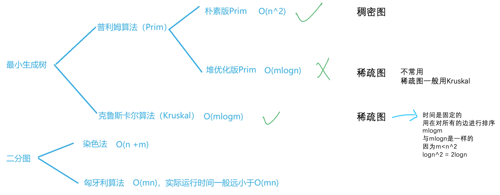

</center>

from yxc


### Directed graphs有向图

概念：

* **Acyclic graphs**: There are no cycles in the graph, so there is no path from any node to itself.

* **Successor graphs**: The outdegree of each node is 1, so each node has a unique successor.

* Directed acyclic graphs are sometimes called **DAG**s.(DAG, 有向无环图)


### Topological sorting拓扑序

A **topological sort** is an ordering of the nodes of a directed graph such that if there is a path from node *a* to node *b*, then node *a* appears before node *b* in the ordering. For example, for the graph one topological sort is [4,1,5,2,3,6]:

<center>

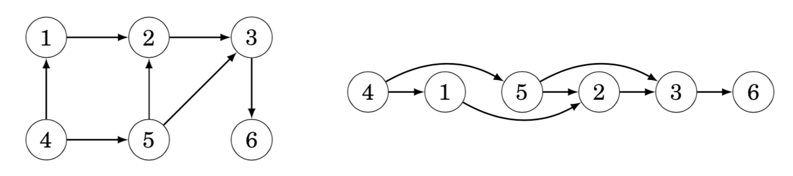

</center>

An acyclic graph always has a topological sort. However, if the graph contains a cycle, it is not possible to form a topological sort, because no node of the cycle can appear before the other nodes of the cycle in the ordering. It turns out that depth-first search can be used to both check if a directed graph contains a cycle and, if it does not contain a cycle, to construct a topological sort.

> topsort就是有向图的宽度优先遍历的应用
> 拓扑序，不唯一。如要要字典序最小的拓扑序，在遍历入度为0的点的时候，从1开始遍历，并入队


### Dynamic programming

If a directed graph is acyclic, dynamic programming can be applied to it. For example, we can efficiently solve the following problems concerning paths from a starting node to an ending node:

* how many different paths are there?

* what is the shortest/longest path?

* what is the minimum/maximum number of edges in a path?

* which nodes certainly appear in any path?


### Counting the number of paths(统计方案数)

As an example, let us calculate the number of paths from node 1 to node 6 in the following graph:

<center>

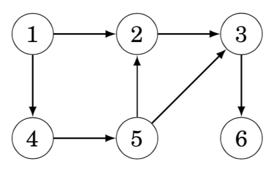

</center>

There are a total of three such paths: 

• 1→2→3→6
• 1→4→5→2→3→6
• 1→4→5→3→6

Let paths(*x*) denote the number of paths from node 1 to node *x*. As a base case, paths(1) = 1. Then, to calculate other values of paths(*x*), we may use the recursion where *a*1,*a*2,...,*ak* are the nodes from which there is an edge to *x*. Since the graph is acyclic, the values of paths(*x*) can be calculated in the order of a topological sort. A topological sort for the above graph is as follows:

<center>

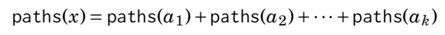


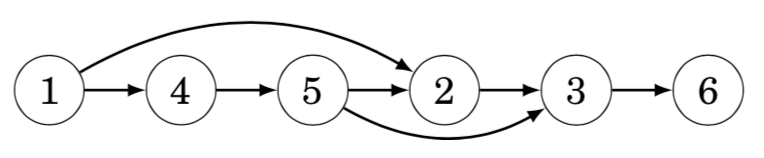

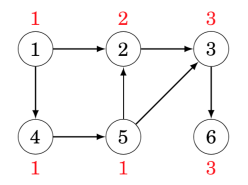

</center>

For example, to calculate the value of paths(3), we can use the formula paths(2) + paths(5), because there are edges from nodes 2 and 5 to node 3. Since paths(2) = 2 and paths(5) = 1, we conclude that paths(3) = 3.

### Extending Dijkstra’s algorithm(对dijkstra得到的最短路径，使用dp)

A by-product of Dijkstra’s algorithm is a directed, acyclic graph that indicates for each node of the original graph the possible ways to reach the node using a shortest path from the starting node. Dynamic programming can be applied to that graph. For example, in the graph the shortest paths from node 1 may use the following edges:

<center>

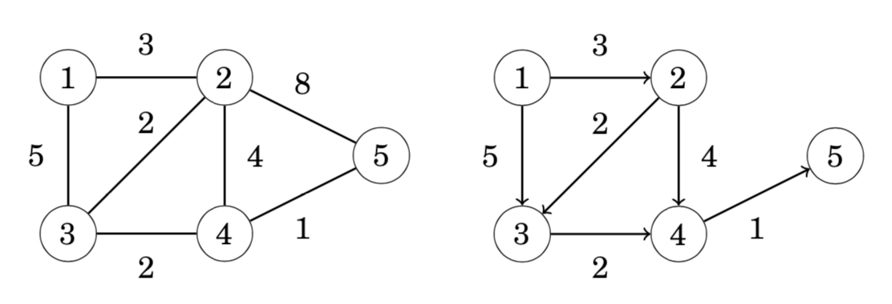

</center>

Now we can, for example, calculate the number of shortest paths from node 1 to node 5 using dynamic programming:

<center>

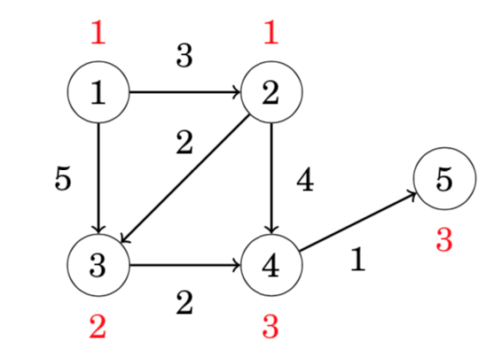

</center>

### Representing problems as graphs(背包问题转化到图上)

Actually, any dynamic programming problem can be represented as a directed, acyclic graph. In such a graph, each node corresponds to a dynamic programming state and the edges indicate how the states depend on each other.

As an example, consider the problem of forming a sum of money *n* using coins {*c*1,*c*2,...,*c*k}. In this problem, we can construct a graph where each node corresponds to a sum of money, and the edges show how the coins can be chosen. For example, for coins {1, 3, 4} and *n* = 6, the graph is as follows:

<center>

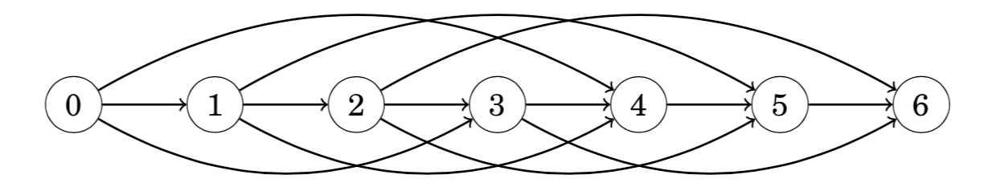

</center>

Using this representation, the shortest path from node 0 to node *n* corresponds to a solution with the minimum number of coins, and the total number of paths from node 0 to node *n* equals the total number of solutions.