# graph图论(二)

**Shortest paths最短路** Finding a shortest path between two nodes of a graph is an important problem that has many practical applications. For example, a natural problem related to a road network is to calculate the shortest possible length of a route between two cities, given the lengths of the roads.

In an unweighted graph, the length of a path equals the number of its edges, and we can simply use breadth-first search to find a shortest path. However, in this chapter we focus on weighted graphs where more sophisticated algorithms are needed for finding shortest paths.

### Bellman–Ford algorithm单源最短路，负权边，可判负环，不超过k边

The **Bellman–Ford algorithm** finds shortest paths from a starting node to all nodes of the graph. The algorithm can process all kinds of graphs, provided that the graph does not contain a cycle with negative length. If the graph contains a negative cycle, the algorithm can detect this.

The algorithm keeps track of distances from the starting node to all nodes of the graph. Initially, the distance to the starting node is 0 and the distance to all other nodes in infinite. The algorithm reduces the distances by finding edges that shorten the paths until it is not possible to reduce any distance.

Let us consider how the Bellman–Ford algorithm works in the following graph:

<center>

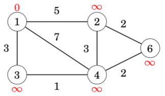

</center>

Each node of the graph is assigned a distance. Initially, the distance to the starting node is 0, and the distance to all other nodes is infinite.

The algorithm searches for edges that reduce distances. First, all edges from node 1 reduce distances:

<center>

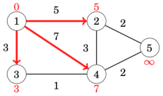

</center>

After this, edges 2 → 5 and 3 → 4 reduce distances:

<center>

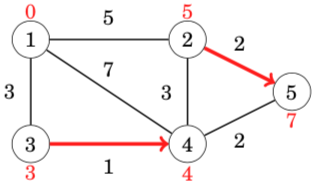

</center>

<center>

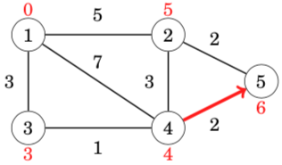

</center>

After this, no edge can reduce any distance. This means that the distances are final, and we have successfully calculated the shortest distances from the starting node to all nodes of the graph.

For example, the shortest distance 3 from node 1 to node 5 corresponds to the following path:

<center>


</center>

```cpp
//直接给出一个完整代码
#include <bits/stdc++.h>

using namespace std;

const int N = 2020, M = 220;

struct Edge
{
	int a, b, w;
}edge[N];

int n, m;
int d[M], bp[M];

int main()
{
	scanf("%d%d", &n, &m);
	for (int i = 1; i <= m; i++) 
		scanf("%d%d%d", &edge[i].a, &edge[i].b, &edge[i].w);

	memset(d, 0x3f, sizeof d);
	d[1] = 0;
	for (int i = 0; i < n - 1; i++)
	{
		memcpy(bp, d, sizeof bp);  //注意要backup，防止串联
		for (int j = 1; j <= m; j++)
		{
			int a = edge[j].a, b = edge[j].b, w = edge[j].w;
			if (d[b] > bp[a] + w) 
				d[b] = bp[a] + w;
		}
	}

	memcpy(bp, d, sizeof bp); //如果还能再更新，就存在环
	for (int j = 1; j <= m; j++)
	{
		int a = edge[j].a, b = edge[j].b, w = edge[j].w;
		if (d[b] > bp[a] + w) 
		{
			printf("circle\n");
			return 0;
		}
	}

	if (d[n] > 0x3f3f3f3f / 2) printf("can't arrive!\n");  //注意d[n]路径中有可能有负权边，不一定是INF，但会是INF量级的
	else printf("%d\n", d[n]);

	return 0;
}
```

```cpp
每个结点的最短距离，最多被更新n-1次
利用这个性质
我们循环n-1次，每次遍历所有的边，当d[b] > backup[a] + w的时候，就更新d[b]

再循环一次，如果还发生更新边的情况，就说明有负环

判断d[n] > 0x3f3f3f3f / 2，就说明不可达

1.为啥d[n] > 0x3f3f3f3f / 2，比如图中有两个点，第n-1个点，第n个点，n-1到n的距离是正值，但是如果n-1个点无法到达，第n个点也无法到达。但是d[n] 会被d[n-1]+w更新，0x3f3f3f3f-w
2.为啥用backup[a] + w来更新d[b],因为1-m每条边更新，如果一条边发生更新，会引发后面的边也传递更新，就发生了串联，就不对了
所以每次更新b的时候，我们用backup[a]的值
```

The time complexity of the algorithm is ***O*(*nm*)**, because the algorithm consists of *n* − 1 rounds and iterates through all *m* edges during a round. If there are no negative cycles in the graph, all distances are final after *n* − 1 rounds, because each shortest path can contain at most *n* − 1 edges.

In practice, the final distances can usually be found faster than in *n*−1 rounds. Thus, a possible way to make the algorithm more efficient is to stop the algorithm if no distance can be reduced during a round.


If the graph contains a negative cycle, we can shorten infinitely many times any path that contains the cycle by repeating the cycle again and again. Thus, the concept of a shortest path is not meaningful in this situation.

A negative cycle can be detected using the Bellman–Ford algorithm by running the algorithm for *n* rounds. If the last round reduces any distance, the graph contains a negative cycle. Note that this algorithm can be used to search for a negative cycle in the whole graph regardless of the starting node.


### SPFA algorithm队列优化的Bellman-Ford

The **SPFA algorithm** (”Shortest Path Faster Algorithm”)  is a variant of the Bellman–Ford algorithm, that is often more efficient than the original algorithm. The SPFA algorithm does not go through all the edges on each round, but instead, it chooses the edges to be examined in a more intelligent way.

The algorithm maintains a queue of nodes that might be used for reducing the distances. First, the algorithm adds the starting node *x* to the queue. Then, the algorithm always processes the first node in the queue, and when an edge *a* → *b* reduces a distance, node *b* is added to the queue.

The efficiency of the SPFA algorithm depends on the structure of the graph: the algorithm is often efficient, but its worst case time complexity is still ***O*(*nm*)** and it is possible to create inputs that make the algorithm as slow as the original Bellman–Ford algorithm.（如果是一个网格状的图，就会卡SPFA）

```cpp
//给出完整代码
#include <bits/stdc++.h>

using namespace std;

const int N = 1e5 + 10;

int n, m;
int h[N], w[N], e[N], ne[N], idx;
int d[N];
bool st[N]; //当前的点是不是在队列当中

void add(int a, int b, int c)
{
	e[idx] = b, ne[idx] = h[a], w[idx] = c, h[a] = idx++;
}

int spfa()
{
	memset(d, 0x3f, sizeof d);
	d[1] = 0;

	queue<int> q;
	q.push(1);
	st[1] = true;

	while (!q.empty())
	{
		int t = q.front(); q.pop();
		st[t] = false;  //维护在没在队列里

        //t变小，他的所有所有出边可能变小。更新过谁，再拿它去更新别人
		for (int i = h[t]; i != -1; i = ne[i])  
		{
			int j = e[i];
			if (d[j] > d[t] + w[i])
			{
				d[j] = d[t] + w[i];
				if (!st[j])
				{
					q.push(j);
					st[j] = true;
				}
			}
		}
	}
	
	return d[n];
}

int main()
{
	scanf("%d%d", &n, &m);

	memset(h, -1, sizeof h);
	for (int i = 0; i < m; i++)
	{
		int a, b, c;
		scanf("%d%d%d", &a, &b, &c);

		add(a, b, c);
	}

	int res = spfa();

	if (res == 0x3f3f3f3f) printf("impossible\n"); //spfa只会更新所有能从起点走到的点，所以如果无解，那么起点就走不到终点，那么终点的距离就是0x3f3f3f3f
	else printf("%d\n", res);

	return 0;
}
```


### Dijkstra’s algorithm单源最短路，边权都是正数

**Dijkstra’s algorithm** finds shortest paths from the starting node to all nodes of the graph, like the Bellman–Ford algorithm. The benefit of Dijsktra’s algorithm is that it is more efficient and can be used for processing large graphs. However, the algorithm requires that there are no negative weight edges in the graph.（原理是基于贪心）

Like the Bellman–Ford algorithm, Dijkstra’s algorithm maintains distances to the nodes and reduces them during the search. Dijkstra’s algorithm is efficient, because it only processes each edge in the graph once, using the fact that there are no negative edges.

Let us consider how Dijkstra’s algorithm works in the following graph when the starting node is node 1:

<center>

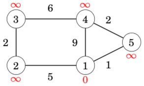

</center>

Like in the Bellman–Ford algorithm, initially the distance to the starting node is 0 and the distance to all other nodes is infinite.

At each step, Dijkstra’s algorithm selects a node that has not been processed yet and whose distance is as small as possible. The first such node is node 1 with distance 0.

When a node is selected, the algorithm goes through all edges that start at the node and reduces the distances using them:

<center>

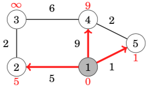

</center>

In this case, the edges from node 1 reduced the distances of nodes 2, 4 and 5, whose distances are now 5, 9 and 1. The next node to be processed is node 5 with distance 1. This reduces the distance to node 4 from 9 to 3:

<center>

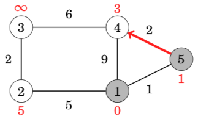

</center>

After this, the next node is node 4, which reduces the distance to node 3 to 9:

<center>

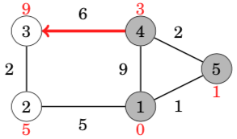

</center>

A remarkable property in Dijkstra’s algorithm is that whenever a node is selected, its distance is final. For example, at this point of the algorithm, the distances 0, 1 and 3 are the final distances to nodes 1, 5 and 4.

After this, the algorithm processes the two remaining nodes, and the final distances are as follows:

<center>

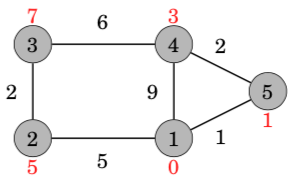

</center>


对于有负权边的图，Dijkstra是不可用的。The shortest path from node 1 to node 4 is 1 → 3 → 4 and its length is 1. However, Dijkstra’s algorithm finds the path 1 → 2 → 4 by following the minimum weight edges. The algorithm does not take into account that on the other path, the weight −5 compensates the previous large weight 6.

<center>

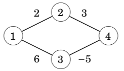

</center>

```cpp
//朴素版，稠密图，O(n^2)
#include <cstring>
#include <iostream>
#include <algorithm>

using namespace std;

const int N = 510;

int n, m;
int g[N][N];
int dist[N];
bool st[N];

int dijkstra()
{
    memset(dist, 0x3f, sizeof dist);
    dist[1] = 0;

    for (int i = 0; i < n - 1; i++)
    {
        int t = -1;
        for (int j = 1; j <= n; j++)
            if (!st[j] && (t == -1 || dist[t] > dist[j]))
                t = j;

        st[t] = true;

        for (int j = 1; j <= n; j++)
            dist[j] = min(dist[j], dist[t] + g[t][j]);
    }

    if (dist[n] == 0x3f3f3f3f) return -1;  
    else dist[n];
}

int main()
{
    scanf("%d%d", &n, &m);

    memset(g, 0x3f, sizeof g);

    while (m--)
    {
        int a, b, c;
        scanf("%d%d%d", &a, &b, &c);
        g[a][b] = min(g[a][b], c);  //重边，邻接矩阵中只存最小的权值
    }

    int t = dijkstra();

    printf("%d\n", t);

    return 0;
}
```

```cpp
//堆优化版，稀疏图，O(n + mlogm)
//the algorithm goes through all nodes of the graph and adds for each edge at most one distance to the priority queue.

#include <bits/stdc++.h>

using namespace std;

typedef pair<int, int> PII;

const int N = 1e4 + 10, M = 2e5 + 10, INF = 0x3f3f3f3f;

int n, m, st, ed;
int h[N], e[M], ne[M], w[M], idx;
int d[N];
bool vis[N];

void add(int a, int b, int c)
{
	e[idx]=  b, w[idx] = c, ne[idx] = h[a], h[a] = idx++;
}

int dijkstra()
{
	memset(d, 0x3f, sizeof d);
	d[st] = 0;

	priority_queue<int> q;
	q.push(make_pair(0, st));

	while (!q.empty())
	{
		PII t = q.top(); q.pop();
		int ver = t.second, dist = -t.first;

		if (vis[ver]) continue;
		vis[ver] = true;
		
		//加强一下对i的理解，for枚举的是散列边，w[i]是边的长度，就是点到点的距离。d[j]>dist+w[i] 
		for (int i = h[ver]; i != -1; i = ne[i])
		{
			int j = e[i];
			if (d[j] > dist + w[i])
			{
				d[j] = dist + w[i];
				q.push(make_pair(-d[j], j));
			}
		}
	}

	if (d[ed] == INF) return -1;
	else return d[ed];
}

int main()
{
	scanf("%d%d%d%d", &n, &m, &st, &ed);

	memset(h, -1, sizeof h);
	while (m--)
	{
		int a, b, c;
		scanf("%d%d%d", &a, &b, &c);

		add(a, b, c);
	}

	int res = dijkstra();
	printf("%d\n", res);

	return 0;
}
```


### Floyd–Warshall algorithm多源汇最短路

The **Floyd–Warshall algorithm** provides an alternative way to approach the problem of finding shortest paths. Unlike the other algorithms of this chapter, it finds all shortest paths between the nodes in a single run.

The algorithm maintains a two-dimensional array that contains distances between the nodes. First, distances are calculated only using direct edges between the nodes, and after this, the algorithm reduces distances by using intermediate nodes in paths.

<center>

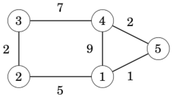

</center>

Initially, the distance from each node to itself is 0, and the distance between nodes *a* and *b* is *x* if there is an edge between nodes *a* and *b* with weight *x*. All other distances are infinite.

In this graph, the initial array is as follows:

<center>

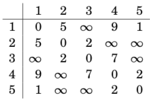

</center>

The algorithm consists of consecutive rounds. On each round, the algorithm selects a new node that can act as an intermediate node in paths from now on, and distances are reduced using this node.

On the first round, node 1 is the new intermediate node. There is a new path between nodes 2 and 4 with length 14, because node 1 connects them. There is also a new path between nodes 2 and 5 with length 6.

<center>

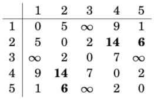

</center>

On the second round, node 2 is the new intermediate node. This creates new paths between nodes 1 and 3 and between nodes 3 and 5:

<center>

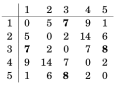

</center>

On the third round, node 3 is the new intermediate round. There is a new path between nodes 2 and 4:

<center>

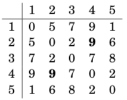

</center>

The algorithm continues like this, until all nodes have been appointed inter- mediate nodes. After the algorithm has finished, the array contains the minimum distances between any two nodes:

<center>

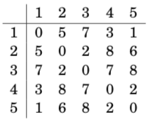

</center>

For example, the array tells us that the shortest distance between nodes 2 and 4 is 8. This corresponds to the following path:

<center>

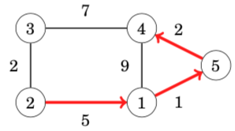

</center>

```cpp
//完整代码
#include <cstring>
#include <iostream>
#include <algorithm>

using namespace std;

const int N = 210, INF = 1e9;

int n, m, Q;
int d[N][N];

void floyd()
{
    for (int k = 1; k <= n; k++)
        for (int i = 1; i <= n; i++)
            for (int j = 1; j <= n; j++)
                d[i][j] = min(d[i][j], d[i][k] + d[k][j]);
}

int main()
{
    scanf("%d%d%d", &n, &m, &Q);

    for (int i = 1; i <= n; i++)
        for (int j = 1; j <= n; j++)
            if (i == j) d[i][j] = 0;
            else d[i][j] = INF;

    while (m--)
    {
        int a, b, w;
        scanf("%d%d%d", &a, &b, &w);

        d[a][b] = min(d[a][b], w);
    }

    floyd();

    while (Q--)
    {
        int a, b;
        scanf("%d%d", &a, &b);

        if (d[a][b] > INF / 2) puts("impossible");
        else printf("%d\n", d[a][b]);
    }

    return 0;
}
```


The time complexity of the algorithm is ***O*(*n^*3)**, because it contains three nested loops that go through the nodes of the graph.

Since the implementation of the Floyd–Warshall algorithm is simple, the algorithm can be a good choice even if it is only needed to find a single shortest path in the graph. However, the algorithm can only be used when the graph is so small that a cubic time complexity is fast enough.（Floyd的原理是动态规划，因为需要使用三重循环，和邻接矩阵建图，要注意数据范围，还有图不能很大）


### 最短路知识结构图

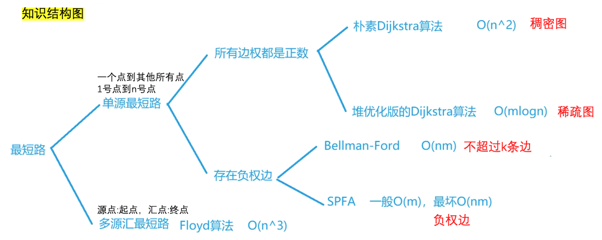

from yxc， orz yxc,   yxc txdy

