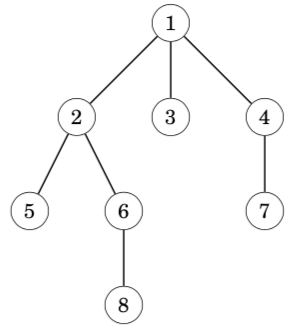
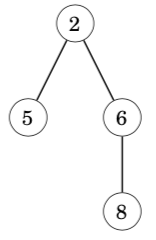
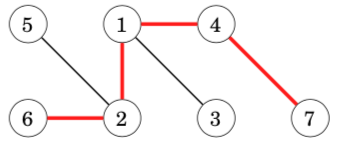
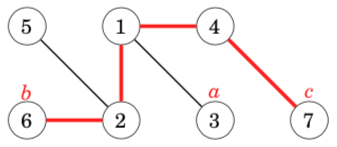
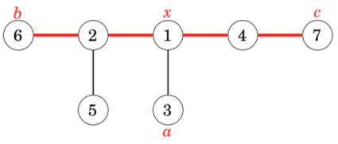
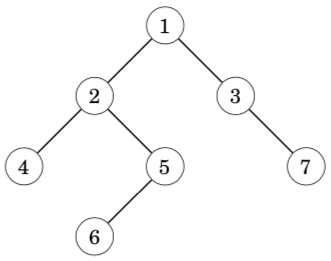

# trees树(一)

注：先学习图，再学习本章节。

A **tree** is a connected, acyclic graph that consists of *n* nodes and *n* − 1 edges. Removing any edge from a tree divides it into two components, and adding any edge to a tree creates a cycle. Moreover, there is always a unique path between any two nodes of a tree.（树是图的一部分，连通的，无环，有n个顶点，n-1条边）

The **leaves** of a tree are the nodes with degree 1, i.e., with only one neighbor.

In a **rooted** tree, one of the nodes is appointed the **root** of the tree, and all other nodes are placed underneath the root. For example, in the following tree, node 1 is the root node.

<center>



</center>

In a rooted tree, the **children** of a node are its lower neighbors, and the **parent** of a node is its upper neighbor. Each node has exactly one parent, except for the root that does not have a parent. For example, in the above tree, the children of node 2 are nodes 5 and 6, and its parent is node 1.

The structure of a rooted tree is *recursive*: each node of the tree acts as the root of a **subtree** that contains the node itself and all nodes that are in the subtrees of its children. For example, in the above tree, the subtree of node 2 consists of nodes 2, 5, 6 and 8:

<center>



</center>

### Tree traversal树的遍历

General graph traversal algorithms can be used to traverse the nodes of a tree. However, the traversal of a tree is easier to implement than that of a general graph, because there are no cycles in the tree and it is not possible to reach a node from multiple directions.

The typical way to traverse a tree is to start a depth-first search at an arbitrary node. The following recursive function can be used:

```cpp
void dfs(int s, int e) { //e代表父亲节点
    // process node s
    for (auto u : adj[s]) {
       if (u != e) dfs(u, s);
    }
}
```

The function is given two parameters: the current node *s* and the previous node *e*. The purpose of the parameter *e* is to make sure that the search only moves to nodes that have not been visited yet.

```cpp
//In the first call e = 0, because there is no previous node, 
//and it is allowed to proceed to any direction in the tree.
	dfs(x, 0);
```


**Dynamic programming使用dp求子树大小(应用)**

Dynamic programming can be used to calculate some information during a tree traversal. Using dynamic programming, we can, for example, calculate in *O*(*n*) time for each node of a rooted tree the number of nodes in its subtree or the length of the longest path from the node to a leaf.

As an example, let us calculate for each node *s* a value count[*s*]: the number of nodes in its subtree. The subtree contains the node itself and all nodes in the subtrees of its children, so we can calculate the number of nodes recursively using the following code:

```cpp
void dfs(int s, int e) {
    count[s] = 1;
    for (auto u : adj[s]) {
       if (u == e) continue;
       dfs(u, s);
       count[s] += count[u];
	} 
}
```


### Diameter树的直径

The **diameter** of a tree is the maximum length of a path between two nodes. Forexample, consider the following tree:

<center>



</center>

Note that there may be several maximum-length paths. In the above path, we could replace node 6 with node 5 to obtain another path with length 4.

Next we will discuss two ***O*(*n*)** time algorithms for calculating the diameter of a tree. The first algorithm is based on dynamic programming, and the second algorithm uses two depth-first searches.

##### **Algorithm 1**

**A general way to approach many tree problems is to first root the tree arbitrarily. After this, we can try to solve the problem separately for each subtree.**  Our first algorithm for calculating the diameter is based on this idea.

An important observation is that every path in a rooted tree has a *highest point*: the highest node that belongs to the path. Thus, we can calculate for each node the length of the longest path whose highest point is the node. One of those paths corresponds to the diameter of the tree.

For example, in the following tree, node 1 is the highest point on the path that corresponds to the diameter:

<center>


</center>

We calculate for each node *x* two values:

* **toLeaf(*x*): **the maximum length of a path from *x* to any leaf
* **maxLength(*x*):** the maximum length of a path whose highest point is *x*

For example, in the above tree, toLeaf(1) = 2, because there is a path 1 → 2 → 6, and maxLength(1)=4, because there is a path 6→2→1→4→7. In this case, maxLength(1) equals the diameter.

Dynamic programming can be used to calculate the above values for all nodes in ***O*(*n*)** time. First, to calculate toLeaf(*x*), we go through the children of *x*, choose a child *c* with maximum toLeaf(*c*) and add one to this value. Then, to calculate maxLength(*x*), we choose two distinct children *a* and *b* such that the sum toLeaf(*a*) + toLeaf(*b*) is maximum and add two to this sum.

```cpp
//类似floyd呢
//还没实现过这种写法,要写一下
```


##### **Algorithm 2 两次dfs**

Another efficient way to calculate the diameter of a tree is based on two depth- first searches. First, we choose an arbitrary node *a* in the tree and find the farthest node *b* from *a*. Then, we find the farthest node *c* from *b*. The diameter of the tree is the distance between *b* and *c*.

In the following graph, *a*, *b* and *c* could be:

<center>



</center>

This is an elegant method, but why does it work?

It helps to draw the tree differently so that the path that corresponds to the diameter is horizontal, and all other nodes hang from it:

<center>



</center>

Node *x* indicates the place where the path from node *a* joins the path that corresponds to the diameter. The farthest node from *a* is node *b*, node *c* or some other node that is at least as far from node *x*. Thus, this node is always a valid choice for an endpoint of a path that corresponds to the diameter.

```cpp
//这个更好实现，就是跑两遍dfs
#include <bits/stdc++.h>

using namespace std;

const int N = 100010;

int h[N], e[N * 2], ne[N * 2], w[N * 2], idx;
int dep[N];
int T, n;
int num, maxn;

void add(int a, int b, int c)
{
	e[idx] = b, ne[idx] = h[a], w[idx] = c, h[a] = idx++;
}

void dfs(int u, int fa)
{
	if (dep[u] > maxn) maxn = dep[u], num = u;

	for (int i = h[u]; i != -1; i = ne[i])
	{
		int j = e[i];
		if (j == fa) continue;

		dep[j] = dep[u] + w[i];
		dfs(j, u);
	}
}

int main()
{
	scanf("%d", &T);

	for (int id = 1; id <= T; id++)
	{
		memset(h, -1, sizeof h);
		idx = 0;

		scanf("%d", &n);

		for (int i = 0; i < n - 1; i++)
		{
			int a, b, w;
			scanf("%d%d%d", &a, &b, &w);

			a++, b++;
			add(a, b, w);
			add(b, a, w);
		}
		
		maxn = 0;
		memset(dep, 0, sizeof dep);
		dfs(1, 0);
		
		maxn = 0;
		memset(dep, 0, sizeof dep);
		dfs(num, 0);
		
		printf("Case %d: %d\n", id, maxn);
	}
	
	return 0;
}
```


### Binary trees二叉树

A **binary tree** is a rooted tree where each node has a left and right subtree. It is possible that a subtree of a node is empty. Thus, every node in a binary tree has zero, one or two children.

For example, the following tree is a binary tree:

<center>



</center>

The nodes of a binary tree have three natural orderings that correspond to different ways to recursively traverse the tree:

* **pre-order**: first process the root, then traverse the left subtree, then traverse the right subtree
* **in-order**: first traverse the left subtree, then process the root, then traverse the right subtree
* **post-order**: first traverse the left subtree, then traverse the right subtree, then process the root

For the above tree, the nodes in pre-order are [1,2,4,5,6,3,7], in in-order [4,2,6,5,1,3,7] and in post-order [4,6,5,2,7,3,1].

If we know **the pre-order and in-order** of a tree, we can reconstruct the exact structure of the tree. For example, the above tree is the only possible tree with pre-order [1, 2, 4, 5, 6, 3, 7] and in-order [4, 2, 6, 5, 1, 3, 7]. In a similar way, **the post-order and in-order** also determine the structure of a tree.

However, the situation is different if we only know the pre-order and post- order of a tree. In this case, there may be more than one tree that match the orderings. For example, in both of the trees the pre-order is [1,2] and the post-order is [2,1], but the structures of the trees are different.

<center>


</center>

一本通中有很多针对二叉树的题目，都是使用the technique of recursion，NOIP真题中有多道类似的题目，需要多加练习。


### 《一本通》题目

##### [【例3-1】找树根和孩子](http://ybt.ssoier.cn:8088/problem_show.php?pid=1336)

```cpp
//fa[N]维护每个结点的父亲，如果一个节点没有fa，他就是根
//son[N]维护孩子个数
```

##### [【例3-2】单词查找树](http://ybt.ssoier.cn:8088/problem_show.php?pid=1337)

```cpp
//trie树，可以高效的存储和查找字符串
```

###### [ 【例3-3】医院设置](http://ybt.ssoier.cn:8088/problem_show.php?pid=1338)

```cpp
//floyd维护出任意两点的距离
//枚举医院的位置，更新res
```

##### [【例3-4】求后序遍历](http://ybt.ssoier.cn:8088/problem_show.php?pid=1339)

```cpp
//给出先序和中序，求后续
void dfs(int l1, int r1, int l2, int r2)
//根据先序l1位置的根，去找中序中根的位置
```

##### [【例3-5】扩展二叉树](http://ybt.ssoier.cn:8088/problem_show.php?pid=1340)

```cpp
//给出扩展二叉树的先序序列，输出中序和后序
//题解给出的是指针写法【指针】
```

##### [小球(drop)](http://ybt.ssoier.cn:8088/problem_show.php?pid=1363)

```cpp
//起初所有节点都是false，访问这个点就会设置成相反状态
//求第i个小球停在哪个叶子结点上
//方法1，模拟1...i个小球的下落过程
//方法2，根据左儿子pos*2，右儿子pos*2+1
//开一个一维数组，维护结点的true和false
```

##### [二叉树遍历(flist)](http://ybt.ssoier.cn:8088/problem_show.php?pid=1364)

```cpp
//给出中序序列和按层序列，求先序序列
//在按层遍历序列中先遇到根，在中序序列中，找到根的位置，break出来
//进行递归处理
void dfs(int l1, int r1, int l2, int r2)
```

##### [FBI树(fbi)](http://ybt.ssoier.cn:8088/problem_show.php?pid=1365)

```cpp
void dfs(int l, int r)
{
    //边界
    
    //子问题
	int len = (r - l) / 2;
	dfs(l, l + len);
	dfs(l + len + 1, r);
	
    //按题意模拟操作
}    
```

##### [二叉树输出(btout)](http://ybt.ssoier.cn:8088/problem_show.php?pid=1366)

```cpp
//给出先序和中序，求凹入表示
int dfs(int l1, int r1, int l2, int r2)
//照样递归下去，dfs返回的是子树大小，用son[N]维护每个结点的子树大小
```

##### [查找二叉树(tree_a)](http://ybt.ssoier.cn:8088/problem_show.php?pid=1367)

```cpp
//题意是，中序遍历的顺序，值为target的结点是第几个被遍历到的
```

##### [对称二叉树(tree_c)](http://ybt.ssoier.cn:8088/problem_show.php?pid=1368)

```cpp
//思路1，从s[1]开始，两两为一单位，要么都是#，要么都不是#
//思路2，根据左儿子和右儿子的位置，去判断左右儿子要么同时为#，要么同时不是#
//两个思路，都需要在读入的字符串后面加上一个#，避免最后一个叶子结点没有兄弟的情况
```

##### [合并果子(fruit)](http://ybt.ssoier.cn:8088/problem_show.php?pid=1369)

```cpp
//小根堆
```

##### [最小函数值(minval)](http://ybt.ssoier.cn:8088/problem_show.php?pid=1370)

```cpp
//用一个大根堆，维护前m个较小值
//如果堆的大小>=m，新读入的数字，比堆顶小，就更新维护进来
```

##### [看病](http://ybt.ssoier.cn:8088/problem_show.php?pid=1371)

```cpp
//priority_queue<node> q;自定义结构体使用优先队列
```

##### [小明的账单](http://ybt.ssoier.cn:8088/problem_show.php?pid=1372)

```cpp
//每天付最大账单和最小账单
//使用multiset维护
```

##### [鱼塘钓鱼(fishing）](http://ybt.ssoier.cn:8088/problem_show.php?pid=1373)

```cpp
//这道题目的处理思路，在另外一个题目也遇到过
//类似的操作是，把路程消耗先消耗掉，然后就可以看做随意跳来跳去的

//枚举最远走到的池塘位置，先把路上消耗的时间先减去
//然后就可以看做已经走过的池塘，可以任意流窜
//把已经走过的池塘，每一分钟可以钓的鱼，维护到一个大根堆中
//然后就变成，有限的时间，取有限次，每次都是取最大值(greedy)
```

