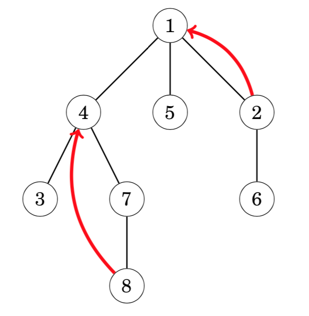

# trees树(二)

### Tree queries

* what is the *k*th ancestor of a node？
* what is the sum of values in the subtree of a node?
* what is the sum of values on a path between two nodes? 
* what is the lowest common ancestor of two nodes?

### Finding ancestors(查找祖先)

The *k*th **ancestor** of a node *x* in a rooted tree is the node that we will reach if we move *k* levels up from *x*. Let ancestor(*x*,*k*) denote the *k*th ancestor of a node *x* (or 0 if there is no such an ancestor). For example, in the following tree, ancestor(2, 1) = 1 and ancestor(8, 2) = 4.

An easy way to calculate any value of ancestor(*x*,*k*) is to perform a sequence of *k* moves in the tree. However, the time complexity of this method is *O*(*k*), which may be slow, because a tree of *n* nodes may have a chain of *n* nodes.