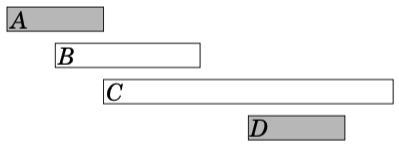
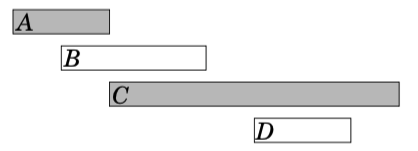
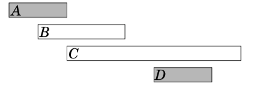
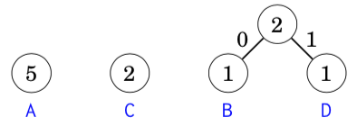
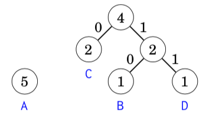
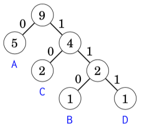

# greedy algorithm 贪心

### 概念

A **greedy algorithm** constructs a solution to the problem by always making a choice that looks the best at the moment. A greedy algorithm never takes back its choices, but directly constructs the final solution. For this reason, greedy algorithms are usually very efficient.

The difficulty in designing greedy algorithms is to find a greedy strategy that always produces an optimal solution to the problem. The locally optimal choices in a greedy algorithm should also be globally optimal. It is often difficult to argue that a greedy algorithm works.

每一步行动总是按某种指标选取最优的操作进行，该指标只看眼前，并不考虑可能造成的影响。可想而知，并不是所有的时候贪心法都能获得最优解，所以一般使用贪心法的时候，都要确保自己能证明其正确性。

### Coin problem硬币问题

As a first example, we consider a problem where we are given a set of coins and our task is to form a sum of money *n* using the coins. The values of the coins are coins={*c*1,*c*2,...,*ck*}, and each coin can be used as many times we want. What is the minimum number of coins needed?

硬币的面值有{1, 2, 5, 10, 20, 50, 100, 200}，如果要取得520元，我们至少需要4枚硬币。200+200+100+20 = 520

然而，贪心并不一直都是最佳方案。比如硬币的面值有{1, 3, 4}，如果需要取得6元，使用贪心的思路，每一次取最大的，取的方案是{4, 1, 1}，三枚硬币。然而，我们知道最佳方案是{3, 3}，只需要两枚硬币。（这时，我们就会遇见动态规划）

### Scheduling时间安排问题

Given *n* events with their starting and ending times, find a schedule that includes as many events as possible. 

<center>

```cpp
event   starting time    ending time
  A            1               3
  B            2               5
  C            3               9
  D            6               8
```

</center>

**算法1**

The first idea is to select as *short* events as possible. In the example case this algorithm selects the following events:

<center>



</center>

However, selecting short events is not always a correct strategy. For example, the algorithm fails in the following case:

<center>


</center>

If we select the short event, we can only select one event. However, it would be possible to select both long events.

**算法2**

Another idea is to always select the next possible event that *begins* as *early* as possible. This algorithm selects the following events:

<center>



</center>

However, we can find a counterexample also for this algorithm. For example, in the following case, the algorithm only selects one event:

<center>


</center>

If we select the first event, it is not possible to select any other events. However, it would be possible to select the other two events.

**算法3**

The third idea is to always select the next possible event that *ends* as *early* as possible. This algorithm selects the following events:

<center>



</center>

It turns out that this algorithm *always* produces an optimal solution. **The reason for this is that it is always an optimal choice to first select an event that ends as early as possible. After this, it is an optimal choice to select the next event using the same strategy, etc., until we cannot select any more events.**

One way to argue that the algorithm works is to consider what happens if we first select an event that ends later than the event that ends as early as possible. Now, we will have at most an equal number of choices how we can select the next event.**Hence, selecting an event that ends later can never yield a better solution, and the greedy algorithm is correct.**


### Tasks and deadlines任务截止时间问题

Let us now consider a problem where we are given *n* tasks with durations and deadlines and our task is to choose an order to perform the tasks. For each task, we earn *d* − *x* points where *d* is the task’s deadline and *x* is the moment when we finish the task. What is the largest possible total score we can obtain?


<center>

```cpp
task     duration     deadline
 A          4             2
 B          3             5
 C          2             7
 D          4             5
```

</center>


In this case, an optimal schedule for the tasks is as follows:

<center>


</center>

In this solution, *C* yields 5 points, *B* yields 0 points, *A* yields −7 points and *D* yields −8 points, so the total score is −10.

Surprisingly, the optimal solution to the problem does not depend on the deadlines at all, but a correct greedy strategy is to simply perform the tasks *sorted by their durations* in increasing order. The reason for this is that if we ever perform two tasks one after another such that the first task takes longer than the second task, we can obtain a better solution if we swap the tasks. For example, consider the following schedule:

<center>


</center>

Here *a* > *b*, so we should swap the tasks:

<center>


</center>

Now *X* gives *b* points less and *Y* gives *a* points more, so the total score increases by *a* − *b* > 0. In an optimal solution, for any two consecutive tasks, it must hold that the shorter task comes before the longer task. Thus, the tasks must be performed sorted by their durations.（假设，右边边界是得分deadline，交换完之后，x得分少得了b分，y得到多了a分，a-b>0，总共会得更多的分数。所以，正确）


### Minimizing sums求最小的和

We next consider a problem where we are given *n* numbers *a*1,*a*2,...,*an* and our task is to find a value *x* that minimizes the sum

<center>


</center>

我们讨论一下，当 c = 1的情况，当 c = 2 的情况

**当 c = 1的情况**

<center>

```cpp
|a1 - x| + |a2 - x| + ... + |an - x|
```

</center>

For example, if the numbers are [1, 2, 9, 2, 6], the best solution is to select *x* = 2 which produces the sum

<center>

```cpp
|1 - 2| + |2 - 2| + |9 - 2| + |2 - 2| + |6 - 2| = 1 + 0 + 7 + 0 + 4 = 12
```

</center>

In the general case, the best choice for *x* is **the *median* of the numbers**, i.e., the middle number after sorting. For example, the list [1, 2, 9, 2, 6] becomes [1, 2, 2, 6, 9] after sorting, so the median is 2.

**The median is an optimal choice**, because if *x* is smaller than the median, the sum becomes smaller by increasing *x*, and if *x* is larger then the median, the sum becomes smaller by decreasing *x*. Hence, the optimal solution is that *x* is the median. If *n* is even and there are two medians, both medians and all values between them are optimal choices.

**当 c = 2的情况**

<center>

```cpp
(a1 - x)^2 + (a2 - x)^2 + ... + (an - x)^2
```

</center>

For example, if the numbers are [1, 2, 9, 2, 6], the best solution is to select *x* = 4.

<center>

```cpp
(1 - 4)^2 + (2 - 4)^2 + (9 - 4)^2 + (2 - 4)^2 + (6 - 4)^2 = 46
```

</center>

In the general case, the best choice for *x* is the *average* of the numbers. In the example the average is (1+2+9+2+6)/5 = 4.

<center>


</center>

The last part does not depend on *x*, so we can ignore it. The remaining parts form a function `nx^2−2x` where *s*=*a*1+*a*2+···+*a*n. This is a parabola opening upwards with roots *x* = 0 and *x* = 2*s*/*n*, and the minimum value is the average of the roots *x* = *s*/*n*, i.e., the average of the numbers *a*1,*a*2,...,*an*.


### Data compression数据压缩（引出Huffman coding的用途）

A **binary code** assigns for each character of a string a **codeword** that consists of bits. We can *compress* the string using the binary code by replacing each character by the corresponding codeword. For example, the following binary code assigns codewords for characters A–D:

<center>

```cpp
charactor      codeword
        A            00
        B            01
        C            10
        D            11
```

</center>

This is a **constant-length** code which means that the length of each codeword is the same. For example, we can compress the string AABACDACA as follows:

<center>

```cpp
000001001011001000
```

</center>

Using this code, the length of the compressed string is 18 bits. However, we can compress the string better if we use a **variable-length** code where codewords may have different lengths. Then we can give short codewords for characters that appear often and long codewords for characters that appear rarely. It turns out that an **optimal** code for the above string is as follows:

<center>

```cpp
charactor      codeword
        A             0
        B           110
        C            10
        D           111
```

</center>

An optimal code produces a compressed string that is as short as possible. In this case, the compressed string using the optimal code is

<center>

```cpp
001100101110100
```

</center>

so only 15 bits are needed instead of 18 bits. Thus, thanks to a better code it was possible to save 3 bits in the compressed string.

We require that no codeword is a prefix of another codeword. For example, it is not allowed that a code would contain both codewords 10 and 1011. The reason for this is that we want to be able to generate the original string from the compressed string. If a codeword could be a prefix of another codeword, this would not always be possible. For example, the following code is *not* valid:

<center>

```cpp
charactor      codeword
        A            10
        B            11
        C          1011
        D           111
```

</center>

Using this code, it would not be possible to know if the compressed string 1011 corresponds to the string AB or the string C.


### Huffman coding哈夫曼编码

**Huffman coding** is a greedy algorithm that constructs an optimal code for compressing a given string. The algorithm builds a binary tree based on the frequencies of the characters in the string, and each character’s codeword can be read by following a path from the root to the corresponding node. A move to the left corresponds to bit 0, and a move to the right corresponds to bit 1.

Initially, each character of the string is represented by a node whose weight is the number of times the character occurs in the string. Then at each step two nodes with minimum weights are combined by creating a new node whose weight is the sum of the weights of the original nodes. The process continues until all nodes have been combined.

Next we will see how Huffman coding creates the optimal code for the string AABACDACA. Initially, there are four nodes that correspond to the characters of the string:


<center>


</center>


The node that represents character A has weight 5 because character A appears 5 times in the string. The other weights have been calculated in the same way.

The first step is to combine the nodes that correspond to characters B and D, both with weight 1. The result is:


<center>



</center>


After this, the nodes with weight 2 are combined:


<center>



</center>


Finally, the two remaining nodes are combined:


<center>



</center>

Now all nodes are in the tree, so the code is ready. The following codewords can be read from the tree:

<center>

```cpp
charactor      codeword
        A             0
        B           110
        C            10
        D           111
```

</center>


### 常见题型

1. 按某种顺序排序后，然后逐个取(sort，多关键字排序，重载小于符号)

2. 每次取集合中的最大/最小，更新答案（使用priority_queue<int>）

**贪心在最优子结构的问题中尤为有效**（最优子结构的意思是问题能够分解成子问题来解决，子问题的最优解能递推到最终问题的最优解。）

**贪心与dp的区别**，贪心对每个子问题的解决方案都做出选择，不能回退。dp会保存以前的运算结果，并根据以前的结果进行选择，有回退功能。有的时候，贪心并不是正确的，比如01背包问题。贪心问题特别像逻辑题，方法很简单，但是证明却很难。考场上，不需要会证明。

贪心法证明的常见方法

* 反证法(假设、调整、做差)

* A>=B, A <= B, 证明A=B

* 数学归纳法


### 《一本通》题目

##### [【例6.1】排队接水](http://ybt.ssoier.cn:8088/problem_show.php?pid=1319)

/排序类型

##### [【例6.2】均分纸牌(Noip2002)](http://ybt.ssoier.cn:8088/problem_show.php?pid=1320)

/按题意for一遍

##### [【例6.3】删数问题(Noip1994)](http://ybt.ssoier.cn:8088/problem_show.php?pid=1321)

/贪心：干掉下降子序列第一个数字。或者模拟取找

##### [【例6.4】拦截导弹问题(Noip1999)](http://ybt.ssoier.cn:8088/problem_show.php?pid=1322)

/LIS，下降子序列个数 和 最长上升子序列长度 对偶

##### [【例6.5】活动选择](http://ybt.ssoier.cn:8088/problem_show.php?pid=1323)

/排序类型，数轴上的问题

##### [【例6.6】整数区间](http://ybt.ssoier.cn:8088/problem_show.php?pid=1324)

/排序类型，数轴上的问题，会用到双指针方法

##### [An Easy Problem](http://ybt.ssoier.cn:8088/problem_show.php?pid=1223)

/暴力枚举，学习使用位运算

##### [最大子矩阵](http://ybt.ssoier.cn:8088/problem_show.php?pid=1224)

/纯暴力会T，学习使用二维前缀和

##### [金银岛](http://ybt.ssoier.cn:8088/problem_show.php?pid=1225)

/排序类型，去性价比最高的

##### [装箱问题](http://ybt.ssoier.cn:8088/problem_show.php?pid=1226)

/小学奥数问题，手搓模拟画图找规律.//https://blog.csdn.net/zqhf123/article/details/104254143

##### [Ride to Office](http://ybt.ssoier.cn:8088/problem_show.php?pid=1227)

/poj题目，题干描述有bug，误以为从0时出发。不如去看英文版

##### [书架](http://ybt.ssoier.cn:8088/problem_show.php?pid=1228)

/排序类型

##### [电池的寿命](http://ybt.ssoier.cn:8088/problem_show.php?pid=1229)

/题干描述和样例，让我误以为电池只有3小时、5小时电量。还是读题障碍

##### [寻找平面上的极大点](http://ybt.ssoier.cn:8088/problem_show.php?pid=1230)

/暴力枚举，n只有100，或者sort一遍后枚举

##### [最小新整数](http://ybt.ssoier.cn:8088/problem_show.php?pid=1231)

/和前面删数是一个类型，换成了多组测试数据

##### [Crossing   River](http://ybt.ssoier.cn:8088/problem_show.php?pid=1232)

/小学奥数类型，对过河问题学习了一手

##### [接水问题](http://ybt.ssoier.cn:8088/problem_show.php?pid=1233)

/priority_queue，注意会写小根堆

### 其他题目

##### [[NOIP2004 普及组\] 火星人](https://www.luogu.com.cn/problem/P1088)

/

##### [[NOIP2007 普及组] 纪念品分组](https://www.luogu.com.cn/problem/P1094)

/

##### [[NOIP2008 普及组\] 排座椅](https://www.luogu.com.cn/problem/P1056)

/

##### [P2672 [NOIP2015 普及组] 推销员](https://www.luogu.com.cn/problem/P2672)

/

##### [P1090 [NOIP2004 提高组] 合并果子 / [USACO06NOV] Fence Repair G](https://www.luogu.com.cn/problem/P1090)

/哈夫曼编码问题，`priority_queue<int>`

##### [P1080 [NOIP2012 提高组] 国王游戏](https://www.luogu.com.cn/problem/P1080)

/

