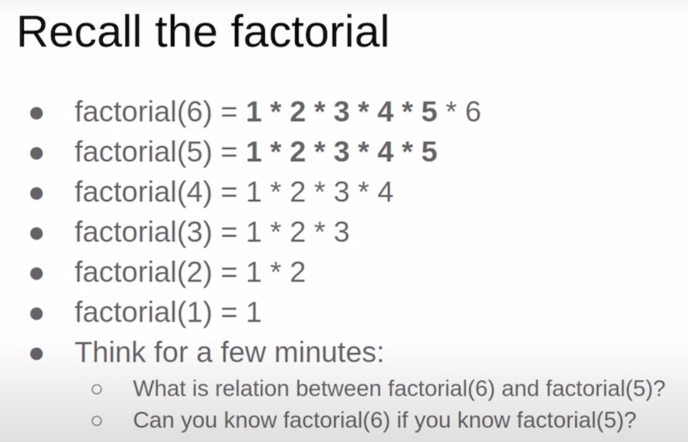
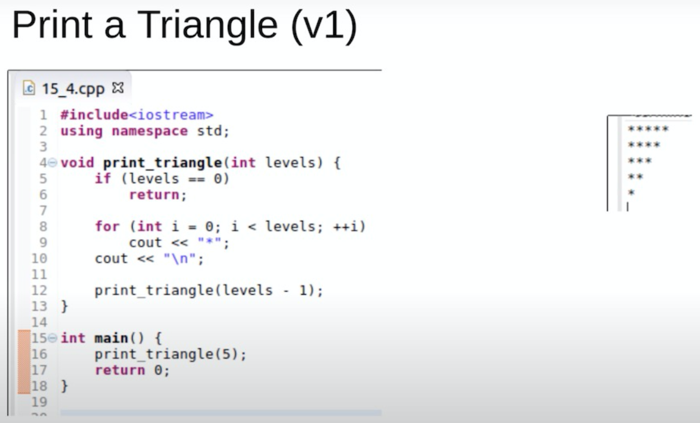
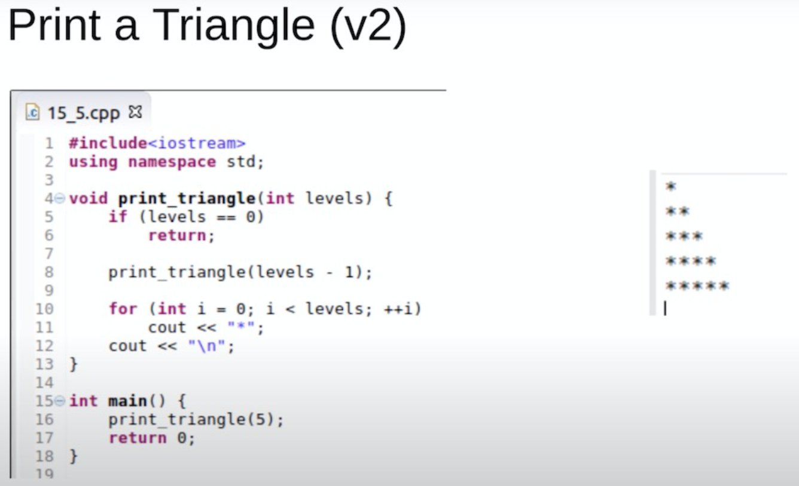
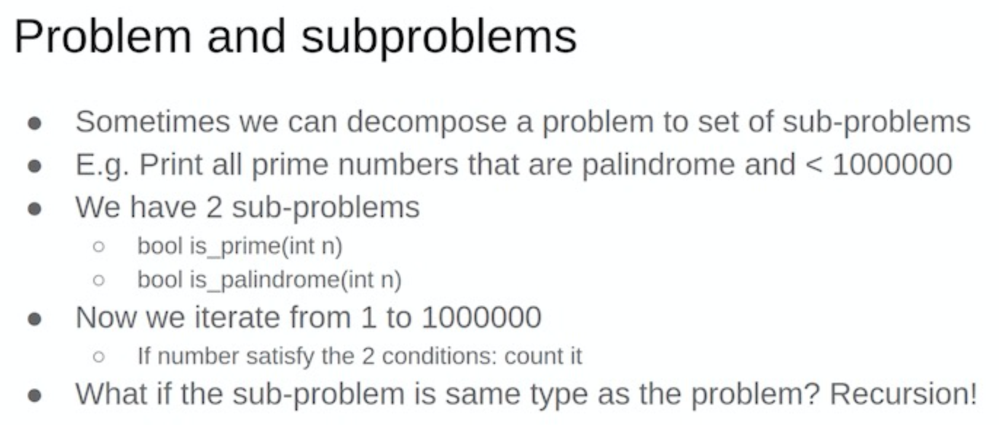
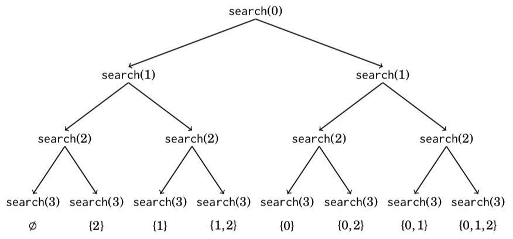

# recursive 递归

### 概念

**递归**是程序遍历状态空间的基本方式。

以“原问题”为起点，尝试寻找把状态空间缩小到已知的“问题边界”的路线，再通过该路线反向回溯的遍历方式，就是递归。

程序在每个步骤应该面对相同种类的问题，这些问题都是原问题的一个子问题，可能仅在规模或者某些限制条件上有所区别，并且能够使用“求解原问题的程序”进行求解。程序在执行变换操作执行三个操作：

1. *缩小问题状态空间的规模。程序尝试寻找在 “原问题” 与 “问题边界” 之间的变换路线，并向正在探索的路线上迈进一步。*
2. *尝试求解规模缩小以后的问题，可能成功，可能失败。*
3. *如果成功，即找到了规模缩小后的问题的答案，那么将答案扩展到当前问题。如果失败，那么重新回到当前问题，程序可能会继续寻找当前问题的其他变换路线，直到最终确定当前问题无法求解。*


**使用递归的前提：** 函数理解深入（带参的函数，有返回值的函数，函数的嵌套(就是“自身调用自身”)）。操作时，试验无限递归，递归的终止条件，“回溯时还原现场”保证执行前后程序面对问题的状态是相同的。

在使用枚举算法蛮力搜索问题的整个“状态空间”时，经常需要递归。（枚举算法，就是遍历一遍，逐个举例。初级的枚举很简单，就是for循环的应用，高级的就很难了，复杂在题目题目和遍历的操作方式）


**—Thinking recursively is natural, but need good amount of training.**

<center>






</center>


```cpp
void TriangleRev(int x) {
   if (x <= 0) return;

   for (int i = 1; i <= x; i++)
        cout << "*";

	cout << endl;

	TriangleRev(x - 1);
}

/*
Call TriangleRev(7)
TriangleRev(7) <-- prints 7 stars & new line
  TriangleRev(6) <-- prints 6 stars & new line
    TriangleRev(5) <-- prints 5 stars & new line
      TriangleRev(4) <-- prints 4 stars & new line
        TriangleRev(3) <-- prints 3 stars & new line
          TriangleRev(2) <-- prints 2 stars & new line
            TriangleRev(1) <-- prints 1 star & new line
              TriangleRev(0) <-- base case
            TriangleRev(1)
          TriangleRev(2)
        TriangleRev(3)
      TriangleRev(4)
    TriangleRev(5)
  TriangleRev(6)
TriangleRev(7)

The output will be:
*******
******
*****
****
***
**
*

*/
```


<center>



</center>


```cpp
void Triangle(int x) {
   if (x <= 0) return;

   Triangle(x - 1);

   for (int i = 1; i <= x; i++)
        cout << "*";
   cout << endl;
}


/*
Call Triangle(7)
Triangle(7)
  Triangle(6)
    Triangle(5)
      Triangle(4)
        Triangle(3)
          Triangle(2)
            Triangle(1)
              Triangle(0) <-- base case
            Triangle(1) <-- prints 1 star & new line
          Triangle(2) <-- prints 2 stars & new line
        Triangle(3) <-- prints 3 stars & new line
      Triangle(4) <-- prints 4 stars & new line
    Triangle(5) <-- prints 5 stars & new line
  Triangle(6) <-- prints 6 stars & new line
Triangle(7) <-- prints 7 stars & new line

The output will be:

*
**
***
****
*****
******
*******
*/
```


<center>



</center>


### How to trace recursion

```cpp
// Factorial(n) = n * Factorial(n-1).		
// Factorial(0) = Factorial(1) = 1

int Fact(int n)
{
	if(n <= 1)
		return 1;

	return n * Fact(n-1);
}

/*
Fact(4)
	4* Fact(3)
		3* Fact(2)
			2* Fact(1)
			2* 1 <-- 2
		3* 2 <-- 6
	4* 6 <-- 24
*/

```


```cpp
void printNumber(int n)	// for n > 0
{	// 1234567
	if(n)
	{
		printNumber(n/10);  // 214/10 = 21
		cout<<n%10;         // 214%10 = 4
	}
}

// E.g. 7 = 111		214 = 11010110
// If number%2 get for us last bit in binray representation
// If we could print last bit, we could print
void printNumberBits(int n)	// for n > 0
{
	if(n)
	{
		printNumberBits(n/2);	// 214/2 = 1101011  last bit removed
		cout<<n%2;              // 214%2 = 0
	}
}
```


### 入门问题

##### [爬楼梯](http://ybt.ssoier.cn:8088/problem_show.php?pid=1204)

```cpp
//理解推导公式后，利用递归实现
```

##### [菲波那契数列](http://ybt.ssoier.cn:8088/problem_show.php?pid=1201)

```cpp
//理解推导公式后，利用递归实现
```

##### [Pell数列](http://ybt.ssoier.cn:8088/problem_show.php?pid=1202)

```cpp
//需要使用记忆化
```


### Complete search

在学习递归之后，我们就学会了遍历问题状态空间的一种方式方法。这样我们就可以去尝试搜索这个问题的状态空间。这里，我们先来接触Complete search（也可以理解为暴力搜索）

**Complete search** is a general method that can be used to solve almost any algorithm problem. The idea is to generate all possible solutions to the problem using brute force, and then select the best solution or count the number of solutions, depending on the problem.

Complete search is a good technique if there is enough time to go through all the solutions, because the search is usually easy to implement and it always gives the correct answer. If complete search is too slow, other techniques, such as greedy algorithms or dynamic programming, may be needed.


##### [问题：生成子集]()

For example, the subsets of {0,1,2} are 􏰀, {0}, {1}, {2}, {0,1}, {0,2}, {1,2} and {0,1,2}.

```cpp
//An elegant way to go through all subsets of a set is to use recursion
void search(int k) {
    if (k == n) {
       // process subset
    } else {
       search(k+1);
       subset.push_back(k);
       search(k+1);
       subset.pop_back();
	} 
}

search(0); //调用
//这个就是递归枚举子集
```


The following tree illustrates the function calls when *n* = 3. We can always choose either the left branch (*k* is not included in the subset) or the right branch (*k* is included in the subset).**（注意反复学习这个搜索树的执行过程）**


<center>



</center>


```cpp
//Each subset of a set of n elements can be represented as a sequence of n bits, which corresponds to an integer between 0...2n −1. The ones in the bit sequence indicate which elements are included in the subset.
//上面的程序，我们使用了一个vector来存储选了什么数字
//这里，我们来学习一下位运算的枚举子集
//这是一个拓展

for (int b = 0; b < (1<<n); b++) {
    vector<int> subset;
    for (int i = 0; i < n; i++) {
       if (b&(1<<i)) subset.push_back(i);
    }
}
```


##### [问题：生成排列]()

For example, the permutations of {0,1,2} are (0,1,2), (0,2,1), (1,0,2), (1,2,0), (2,0,1) and (2,1,0).

```cpp
//Each function call adds a new element to permutation. The array chosen indicates which elements are already included in the permutation. If the size of permutation equals the size of the set, a permutation has been generated.

void search() {
    if (permutation.size() == n) {
       // process permutation
    } else {
       for (int i = 0; i < n; i++) {
           if (chosen[i]) continue;
           chosen[i] = true;
           permutation.push_back(i);
           search();
           chosen[i] = false;
           permutation.pop_back();
       }
	} 
}

search(); //调用
```

```cpp
//The C++ standard library contains the function next_permutation that can be used for this

vector<int> permutation;
for (int i = 0; i < n; i++) {
    permutation.push_back(i);
}
do {
    // process permutation
} while (next_permutation(permutation.begin(),permutation.end()));
```


### 《进阶指南》题目

##### [递归实现指数型枚举](https://www.acwing.com/problem/content/94/)

子集枚举

```cpp
vector<int> chosen;

void dfs(int x)
{
    if (x == n + 1)   //也可以写x > n
    {
        for (int i = 0; i < chosen.size(); i++)
            printf("%d ", chosen[i]);
        puts("");

        return ;
    }

    //问：先不选x， 还是先选x。会影响我们的输出顺序
    //观察样例，我们先不选x
    
    //不选x，求解子问题
    dfs(x + 1);

    //选x，求解子问题
    chosen.push_back(x);
    dfs(x + 1);
    chosen.pop_back();  //回溯还原现场
}
```

```cpp
//位运算版本，这是进阶的
void dfs(int u, int state)
{
    if (u == n)
    {
        for (int i = 0; i < n; i++)
            if (state >> i & 1)
                cout << i + 1 << ' ';
        puts("");

        return ;
    }

    //求解子问题
    dfs(u + 1, state);          //不选，state初始是0，等价于dfs(u + 1, state & (~(1 << u)));
    dfs(u + 1, state | 1 << u); //选
}
```


##### [递归实现组合型枚举](https://www.acwing.com/problem/content/95/)

在子集枚举的基础上，进行剪枝

```cpp
vector<int> chosen;

void dfs(int x)
{
    if (chosen.size() > m || chosen.size() + (n - x + 1) < m) return ;
    
    if (x == n + 1)
    {
        //如何输出状态
        for (int i = 0; i < chosen.size(); i++)
            printf("%d ", chosen[i]);
        puts("");

        return ;
    }
    //选x
    chosen.push_back(x);
    dfs(x + 1);
    chosen.pop_back();
    
    //不选x
    dfs(x + 1);
}
```

```cpp
//递归实现，枚举的时候带着顺序
void get_combination(int u, int last)
{
	if (u == m){
		for (int i = 0; i < m; i++) printf("%d ", chosen[i]);
		puts("");
	}

	for (int j = last + 1; j <= n; j++){
		chosen.push_back(j);
		get_combination(u + 1, j);
		chosen.pop_back();
	}
}
```

```cpp
//位运算版本，这是进阶的
//state表示状态
void dfs(int u, int sum, int state)
{
    if (sum > m || sum + n - u < m) return ;
    
    if (sum == m)
    {
        for (int i = 0; i < n; i++)
            if (state >> i & 1)
                cout << i + 1 << ' ';
        puts("");
        
        return ;
    }
    
    dfs(u + 1, sum + 1, state | 1 << u);
    dfs(u + 1, sum    , state         );
}
```


##### [递归实现排列型枚举](https://www.acwing.com/problem/content/96/)

排列枚举

```cpp
//用数组存方案
//注意一下 0-index，如果是 1-index 呢？递归的边界是....什么？(提问)

void dfs(int k)
{
    if (k == n)
    {
        for (int i = 0; i < n; i++)
            cout << order[i] << ' ';
        puts("");
    }
    
    for (int i = 1; i <= n; i++)
    {
        if (chosen[i]) continue;
        
        order[k] = i;
        chosen[i] = true;
        dfs(k + 1);
        chosen[i] = false;
    }
}
```

```cpp
//用vector来存方案，用二进制数来记录状态

vector<int> path;
void dfs(int u, int state)
{
    if (u == n)
    {
        vector<int>::iterator i;
        for (i = path.begin(); i < path.end(); i++)
            cout << *i << ' ';
        puts("");
    }
    
    for (int i = 0; i < n; i++)
        if (!(state >> i & 1))
        {
            path.push_back(i + 1);   //用vector来记录方案
            dfs(u + 1, state | 1 << i);
            path.pop_back();
        }
}
```


### 《一本通》题目

##### [【例4.5】集合的划分](http://ybt.ssoier.cn:8088/problem_show.php?pid=1315)

```cpp
//{an}是k子集合中的一个,S(n-1, k-1)
//{an}不是k子集合中的任意一个子集，an与其他元素构成了子集，问题相当于S(n-1,k)。把an加入到k个子集中的任意一个中，有k种加入的方法
```

##### [【例4.6】数的计数(Noip2001)](http://ybt.ssoier.cn:8088/problem_show.php?pid=1316)

```cpp
//子问题是[1...x/2]
for (int i = 1; i <= x / 2; i++){
		dfs(i);
		h[x] += h[i];
}
```

##### [逆波兰表达式](http://ybt.ssoier.cn:8088/problem_show.php?pid=1198)

```cpp
//* a b
//读入的是*号，我们就返回 dfs() * dfs()
    
//这个题目的难点是string转double，如何转
```

##### [全排列](http://ybt.ssoier.cn:8088/problem_show.php?pid=1199)

```cpp
//前面的例题
```

##### [分解因数](http://ybt.ssoier.cn:8088/problem_show.php?pid=1200)

```cpp
//求的是分解的方案数， 有两种分析的方法

//1. dfs(x, y)，调用时dfs(x, 2)，从2开始向上搜索x的约数
	边界是x==1        
	for (int i = y; i <= x; i++)  //从y往上找x的约数，如果找到，就求解子问题dfs(x/i, i)
		if (x % i == 0) res += dfs(x / i, i);

//2. dfs(a, b)，从b开始向下搜索a的约数，调用时dfs(x, x)
	边界是a == 1 和 b == 1
    如果a % b == 0，我们就 res += dfs(a / b, b); 把这个约数除掉，求解子问题
	如果a % b != 0，我们就 dfs(a, b - 1); 往下看子问题
```

##### [菲波那契数列](http://ybt.ssoier.cn:8088/problem_show.php?pid=1201)

```cpp
//
```

##### [Pell数列](http://ybt.ssoier.cn:8088/problem_show.php?pid=1202)

```cpp
//
```

##### [扩号匹配问题](http://ybt.ssoier.cn:8088/problem_show.php?pid=1203)

```cpp
//模拟搜索的过程，用递归实现这个搜索的模拟过程（这个就不是什么数字上的往深层次递归了，这是模拟）
//遇到左括号，就先标记上
//遇到右括号，就从当前位置往前找“有标记的左括号”
//找到了，就取消左括号的标记；没找到，就把这个右括号，标记起来
```

##### [爬楼梯](http://ybt.ssoier.cn:8088/problem_show.php?pid=1204)

```cpp
//
```

##### [汉诺塔问题](http://ybt.ssoier.cn:8088/problem_show.php?pid=1205)

```cpp
//
```

##### [放苹果](http://ybt.ssoier.cn:8088/problem_show.php?pid=1206)

```cpp
//把M个同样的苹果放在N个同样的盘子里，允许有的盘子空着不放，问共有多少种不同的分法？
//这道题目意义深远，打个星号
//分情况讨论，盘子比苹果多的情况，苹果比盘子多的情况
```

##### [求最大公约数问题](http://ybt.ssoier.cn:8088/problem_show.php?pid=1207)

```cpp
//介绍GCD模板
```

##### [2的幂次方表示](http://ybt.ssoier.cn:8088/problem_show.php?pid=1208)

```cpp
//这道题比较复杂，作为拓展学习，涉及位运算，对理解二进制数有帮助
//先分析一下边界
//然后找到小于等于这个数的2的最大幂次，可能还有一个尾巴剩余
//对幂次进行递归处理
```

##### [分数求和](http://ybt.ssoier.cn:8088/problem_show.php?pid=1209)

```cpp
//模拟两个分数相加的过程，通分和约分
//约分的时候用到GCD
```

##### [因子分解](http://ybt.ssoier.cn:8088/problem_show.php?pid=1210)

```cpp
//分解质因数
```

##### [判断元素是否存在](http://ybt.ssoier.cn:8088/problem_show.php?pid=1211)

```cpp
//用递归遍历问题的状态空间，进行暴力枚举
//这个也是模拟，递归往远处模拟排查
```

