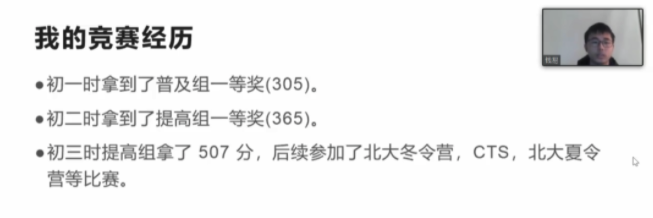
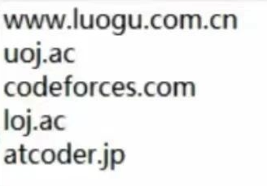

# 对话IOI2021国家队成员！直播超详细文字珍藏版来啦

### **虞皓翔**

**宁波市镇海中学 高三**

**2019年同时入选数学和信息学国家集训队**

**NOI2020位居第一 入选国家集训队**

我从初一开始接触竞赛，相对来说有些晚。但是从小学开始就培养起了对于编程的兴趣。那时候玩各种游戏，发现有的人开了挂，非常厉害。后来才知道这是因为他们写了类似脚本的东西，可以帮助修改参数，还可以帮助做一些游戏和有用的东西。

 

于是就开始在各种论坛和网站上自学了信息新技术和编程相关的知识，并用一些小语言编了一些东西 。那时候我其实并不知道NOIP这种类型的竞赛，甚至对这些竞赛的认知还停留在“不务正业”的阶段。

 

2015年，凭借数学跨级奖项进入蛟川书院，开始正式学习信息学。

 

一开始在学校的训练一周只有两次，主要集中在每周五晚和每周日下午。尽管时间不长，但因为老师们的培养和同学们之间的交流，也得到了很大的提升，初一获得了NOIP普及组一等奖，初二获得了NOIP提高组一等奖。

 

初三时，因为不同操作系统的差异，两天比赛的的第二题都出现了错误，直接扣掉了200分。最终只得到了350分的成绩，卡提高组一等线10分。这就意味着冬令营不能去，省选没有资格，CTSC和APIO也无法参加。

 

在老师和父母的安慰下，我很快调整好了心态。在清华冬令营获得了全营第二的成绩，也终于获得了清华无条件一本的签约。

 

初三下半年开始正式进入镇海中学学习，开始接触基本的软件开发。

 

2019年，以全国第14名的成绩进入了信息学国家集训队，签了清华的计算机系。一个多月后，去参加数学竞赛，以全省第三的成绩进入了省队。幸运地是在11月的CMO中，以20多名的排名进入了数学国家集训队，换了一张清华姚班的签约。

 

后来在IOI2020选拔的四场考试中，由于第一天的失误，即便最后NOI取得全国第一的成绩，最终也只获得了IOI国家队候选第六的成绩，无缘参加IOI2020。

 

这次经历后，我总结出了一个非常重要的教训：**每一场考试都要认真对待，不能出现大的失误，否则在后面就很难再补上**，尤其是国家队只有四个名额，机会比较窄的情况下。

 

高二在疫情期间开始补充短板，做了很多题，后面的发挥才比较稳定，最终入选IOI2021的国家队。

 

给大家提一点为可供参考的建议：

 

**第一点，是兴趣，**兴趣是最好的老师*你对信息学有兴趣，你就会自发地学习，尽管可能在别人眼里看起来很枯燥，在你眼中却是魅力无穷的，怎样学都不会觉得累。

 

**第二点，平台很重要，你要在一个好的平台、好的学校，善于利用资源。**如果当初没有进入蛟川书院的话，我是不可能获得现在的成绩的，也许兴趣和天赋可能就浪费掉了。

 

镇海中学有一个非常好的、经验丰富的团队，老师会给我们指引正确的方向，指导我们做正确的事情。还有很多线上和线下的小伙伴，能够一起探究，一起讨论。这样在不知不觉中就会获得很大的进步，越走越远，进入一个良性循环。

 

**第三点，数学的基础很重要。**大家也能发现，在今年IOI2021的国家队中，我跟邓明扬都是数学竞赛的学生。我们熟知的达芬奇也认为“数学是一切科学的基础”。就像一棵树，数学是根基，其他的竞赛如物理、信息学都是他的枝叶。要想在信息学上走得远，数学的基础必须要好。

 

数学和信息学这两门学科在思维方式上是非常相似的，联系也十分密切。我们在学习一门的时候也要注意锻炼另一门的思维。如果每一门竞赛都花上75%的时间，只要思维跟上了，另一门也不会差。

 

**第四点，要有科学的学习方法。**当你到了一定高度的时候，往往需要自己去摸索。很多竞赛教练往往会带你到普及组或提高组，再往上就需要自己探索。在找资料，阅读书籍以外，还要形成找论文的习惯，这还要求你有一定的英语基础，尤其是学术词汇。

 

**最后，尤其重要的一点是，要养成良好的代码习惯，**自己看着要舒服和赏心悦目。近两年十分流行的python语言，没有大括号，通过缩进来进行分区，其实就是在引导大家养成规范写代码的好习惯。

 

任何竞赛道路都不可能会一帆风顺，要保持良好的心态。**“实力保证你的下限，心态保证你的上限”**。如果真的热爱OI，热爱信息学，无论遇到什么挫折，都要保持这份热忱，不忘初心，为自己、为学校、为所有oler增光添彩，为科学兴国贡献自己的绵薄之力。

 

推荐图书：

除了经典的刘汝佳的教材之外，还可以看《算法导论》、《编译原理》、《具体数学》、《计算机程序与艺术》、《算法心得》等名著。

### **邓明扬**

**中国人民大学附属中学 高三**

**数学和信息学双科国家队选手**

**IMO2019金牌**

**MIT中国大陆唯一常规录取者**

“我接触到信息学竞赛是在早六早七的时候，喜欢写小游戏，老师鼓励我开始研究更深奥的问题，就这样入了信息学竞赛的“坑”。

 

初一参加普及组，因为一些小失误，“荣获”普及组二等奖。初二时水平提高了一些，状态好很多，获得了NOIP提高一等奖，进了北京省队，当年的NOI拿了银牌。

 

初三时，以非常高的优势进了北京省队。有一场比赛，比第二名高了一倍多的分数。

 

后面NOI虽然挂了一些分，以第7名的成绩拿到了金牌，但由于是初中生，不能进入国家集训队。

 

高一，因为与数学国际比赛冲突，没有参加NOI而去参加了数学国际比赛。所以我只有这一次机会可以进国家队，幸运的是，我抓住了这次机会。

 

我在数学竞赛方面比信息学顺利很多，初三进省队后直接进集训队，高一以比较大的优势进了国家队拿了金牌。

 

给大家的建议：

**初学先尽量自己调代码，这是需要练的技能。**

 

最开始学知识时，可以通过一些课程和书籍，把最基础的知识跟下来，普及提高省选都尽量跟一下。如果是在竞赛资源不丰富的地方，还可以利用网络找到资源。

 

**之后就要多练。不仅练打代码的速度和准确性，也练思考问题的能力。**我有一段时间打了一些线上的比赛，短时间内打起来非常快乐、投入，对我的帮助很大，训练效果很好。

 

在数学信息学竞赛或者是学校期中期末文化课的时间分配上，要排优先级。时间不在多，效率要高，每天学两个小时，多学一些题，多思考，对你的帮助就足够了。竞赛冲刺阶段可能需要停课集中训练。

 

在心态调整上，比赛之前我都会提醒自己要享受这次比赛，因为我打NOI的初衷就是因为我觉得它非常有意思。享受比赛时，你也会很快乐，不会紧张焦虑，而且心态轻松时，会打的好一点。

 

筹备比赛时，我一般也不会刷题刷到很晚。一般下午打比赛，晚上10-11点就上床睡觉，保持一个健康的作息。

 

在冲刺省选时，建议大家先学完知识，做一些省选模拟赛，把知识都掌握，尽量少挂分。

在考试中如果遇到不会做的题目，不建议一味地死磕，会很吃亏。**考前可以先制定一个策略，想好一道题用的最低时间。**考试时先把所有题的基础部分打满，每道题的最低时间要保证，剩余的时间再用来钻研。平时也要多练习，多写代码。

每道题的最低时间可以参考这个公式：**总时间减去1小时，平均到每道题上，就是每道题的最低时间。**

### **钱易**

**宁波市镇海中学 高二**

**此次国家队唯一一名高二学生**

**ISIJ2019金牌、 NOI2019D类金牌**

我从小学就开始接触信息学，学习过OI，在绍兴市市赛获得了一等奖。

初二初三进步最大。初二暑假在学校集训，做了很多针对性的题目进行训练，这对于知识点的巩固非常重要。

 

知识点学的差不多时，会跟伙伴讨论。每个人思考的方式不同，我们也能因此获得原来不清楚的知识，提高学习效率。

 

初三的时候我做题非常注重思考，当时自己也命制了一些简单的题目。对于一个数据结构，我也会思考：

 

***它能干什么事情？它能在什么时候使用？***

***什么时候不能使用？为什么不能在什么时候使用？***

 

这些思考对我实力提升非常大，下半年发挥的比较好。

推荐书目：

主要推荐《算法导论》，里面一些算法讲的很清楚。

 

如何提高思维水平：

**多做题。做的题越多，就很容易从之前某一道题的做法中来联想到新的题目怎么做。**

我在平衡信息学和校内课程的冲突时，初一以文化课学习为主，初二停了一些美术、音乐课，文化课成绩稳定。初三晚自习去机房写题，九点钟回宿舍写作业到11点半。尽量补完文化课的作业，让文化课成绩过得去。

 

当做题正确率低时不要灰心，可以通过练习慢慢提高。考试时如果没有头绪，可以洗把脸，冷静一下 ，想想平时怎么做，考试就怎么做。平时也要多多刷题，做一些针对知识点的练习，多参加一些比赛，这样提升水平还是非常快的。

推荐一些刷题网站：

### **代晨昕**

**广州市第二中学 高三**

**初三获得清华大学计算机系一本线预录取**

**NOI2020高分入选国家集训队**

我从小学六年级开始接触编程。最先开始接触的是语言逻辑十分严谨的Pascal语言。当时就被这种用逻辑严谨的语句处理各种问题的编程深深吸引，逐渐接触到算法竞赛，并开始开始学习C++语言。

 

初三参加清华冬令营获得清华无条件一本签约；提高组一等奖，获得了无条件一本协议。高一成功进入省队；CTSC选拔赛，拿到第一个全国金牌奖项。高二进入国家集训队；高三进入国家队。

在初三拿到提高组一等奖之前，我在竞赛方面的进步不够大。在高一NOIP一等奖以后，痛定思痛决定好好补一补短板，得到了很大的提升。

高二这一年，我做了非常多的训练，并且开始做一个计划，**包括每个星期我需要做那些题、学什么知识点。这个计划该我带来了非常大的进步。**

 

给初学者的一些建议：

刚开始学习会发现要学的东西非常多，非常难，这时候不要害怕，要打好基础慢慢学。理解知识点往往没难度，熟练掌握才是真正难的地方。理解没难度。**对于不理解的数据结构，一定要自己从头到尾打一遍，深刻理解。**

 

**到达一定水平以后，和其他选手的交流也特别重要。**选手之间会在UOJ用户群提各种各样的问题，我们就可以借此机会查缺补漏，让自己掌握地更加全面。另外，尽可能和比你水平高的选手多交流。我非常幸运地遇到了马耀华同学，他一路给了我非常多的帮助。

 

推荐一些数书目：

入门推荐刘汝佳的《算法竞赛入门经典》红书和蓝书。想要进一步掌握数学知识的话，推荐《具体数学》《组合数学》这两本，书中有信息学竞赛会用到的数学知识。

原文：https://mp.weixin.qq.com/s/N9L8utNcEYJN7s3b0lM1jg

