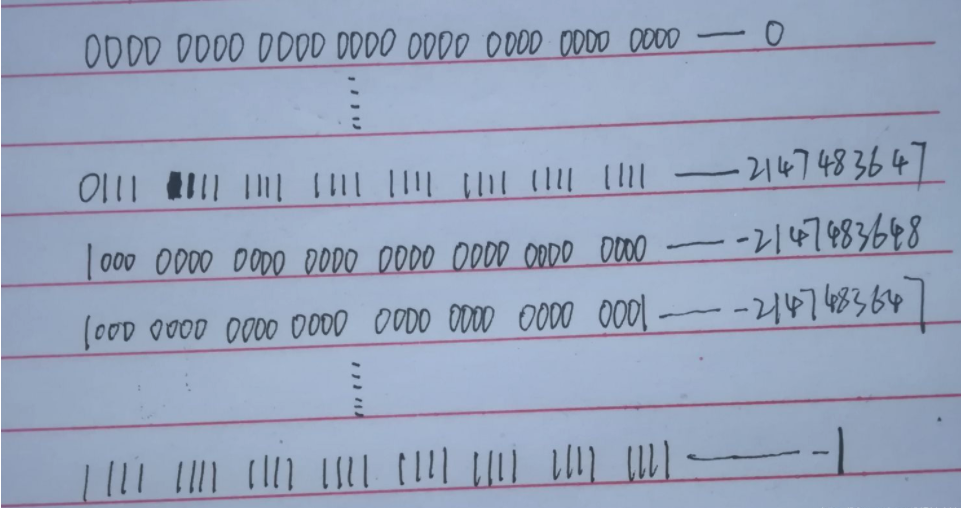

# int型数据类型为什么取值范围是-2^31~2^31-1

正数在计算机中表示为原码，最高位为符号位:

1的原码为0000 0000 0000 0000 0000 0000 0000 0001

2147483647的原码为0111 1111 1111 1111 1111 1111 1111 1111

所以最大的正整数是2147483647

负数在计算机中表示为补码，最高位为符号位：

-1的原码为1000 0000 0000 0000 0000 0000 0000 0001，

反码为1111 1111 1111 1111 1111 1111 1111 1110，

补码为1111 1111 1111 1111 1111 1111 1111 1111

-2147483647：

原码为1111 1111 1111 1111 1111 1111 1111 1111，

反码为1000 0000 0000 0000 0000 0000 0000 0000，

补码为1000 0000 0000 0000 0000 0000 0000 0001

所以最小的负数是-2147483647吗？错，不是。

在二进制中，0有两种表方法。

+0的原码为0000 0000 0000 0000 0000 0000 0000 0000，

-0的原码为1000 0000 0000 0000 0000 0000 0000 0000，

因为0只需要一个，所以把-0拿来当做一个最小的数-2147483648。

-2147483648的补码表示为1000 0000 0000 0000 0000 0000 0000 0000，在32位没有原码。

注意，这个补码并不是真正的补码，真正的补码是1 1000 0000 0000 0000 0000 0000 0000 0000，溢出。

所以带符号32位int类型整数为-2147483648~2147483647

最后自己贴一张图就当做是时刻提醒自己吧

[https://blog.csdn.net/HPU_LY/article/details/83995407](https://blog.csdn.net/HPU_LY/article/details/83995407)

